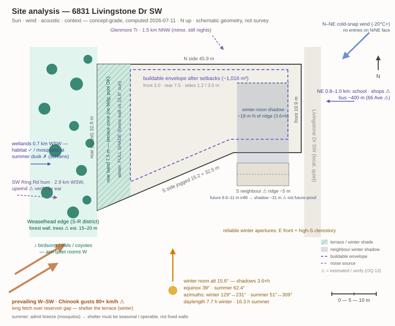
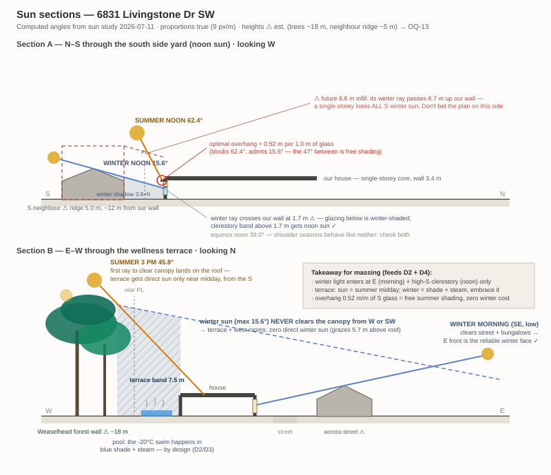

# Site details — 6831 Livingstone Drive SW (Nonimuss Residence)

## Selected lot
**6831 Livingstone Dr SW, Lakeview, Calgary** (rear edge ~50.99257, -114.13529) — west side of Livingstone Dr, rear property line directly abutting the Weaselhead-edge park district (verified: coordinate probe 15 m beyond rear line returns S-R, Special Purpose – Recreation; no road or residential between). Selected 2026-07-05, replacing 3302 Lassiter Ct SW after Ben's ground-truth caught a false forest-adjacency claim — see decision log. Studio premise: treated as vacant (1966 dwelling on title today). [Aerial](https://www.google.com/maps/@50.99258,-114.1350,180m/data=!3m1!1e3)

## Parcel record
| Item | Value | Source |
|---|---|---|
| Area | **1,216.8 m²** (city) / 1,213 m² (shoelace check on polygon) | Assessment dataset 4bsw-nn7w, roll 109034306, 2026 |
| Geometry | N side 45.9 m (due E-W) · **W rear (forest) 32.9 m** (due N-S) · S boundary = **one straight diagonal 47.7 m** (two collinear survey segments 15.2 + 32.5 m, both bearing 74.2°) rising from SW corner to street · E front 19.9 m. CORRECTED 2026-07-11 — earlier "jogged" reading was a mis-reconstruction; source polygon now stored in `data/parcel_6831-Livingstone-Dr-SW.geojson` | Parcel polygon (Socrata 4bsw-nn7w, re-fetched + verified 2026-07-11) |
| Land use | **R-CG** (assessment roll + land use district dataset, cross-checked) | City data, 2026-07-05 |
| Assessed | $2,120,000 (2026, RE class, land + 1966 improvement) | Assessment dataset |
| Elevation | Front ~1,104 m, rear ~1,105 m — flat (CDEM ~20 m grid, concept-grade) | NRCan CDEM API |

## Site facts
| Category | Fact | Source | Design implication |
|---|---|---|---|
| Rear adjacency | S-R park district; Weaselhead Flats + escarpment beyond; reservoir ~1,076 m below, further in | Land use probe + CDEM | The forest wall is real here: rear yard dissolves into park trees. Ben's visual check passed |
| Front setback | 3.0 m (s.537) | LUB 1P2007 Div 11 | Short approach from Livingstone Dr |
| Side setbacks | 1.2 m; laneless → 3.0 m one side unless garage at front/side (s.539(2)) | LUB 1P2007 | 3.0 m side slot = garden path or carport lane |
| Rear setback | 7.5 m (s.540(1), laneless) | LUB 1P2007 | 7.5 × 32.9 m rear band against the forest — the wellness terrace zone (pool ≠ building) |
| Height | 11.0 m base; 8.6 m cap between rear line and 60% depth (s.541(4)); **no contextual 45° plane at rear** (neighbour is park district, not low-density residential, s.541(2)) | LUB 1P2007 + district probe | Mass steps down toward forest; tall element (if any) in front 40% |
| Coverage | 45% = **548 m²** max (s.534(2)(a)); −21 m² if a required stall not in garage | LUB 1P2007 | 120 m² footprint uses 22% — no pressure |
| Building depth | ≤65% of 45.9 m ≈ 29.8 m (s.535) | LUB 1P2007 | Compact bar fits several ways |
| Buildable envelope | ~28.7 × 35.4 m (≈1,016 m²) after setbacks | Computed | Enormous freedom for a 120 m² house + satellites: siting is a choice, not a fight |
| Landscaping/trees | 1 tree + 3 shrubs per 110 m² → **12 trees + 34 shrubs**; preserved deciduous >100 mm = 3 credits each (s.542.2); ≥30% soft surface (s.542(7)) | LUB 1P2007 | Mature 1966-era trees likely satisfy most of it — keep-every-tree pays again |
| Parking | 1.0 stall min (s.546); client wants 2+2 | LUB 1P2007 | Visitor pair on street/front apron |
| Orientation | Front/street ≈ E; rear/forest ≈ W; long axis E-W; S side faces neighbour | Parcel geometry | S light enters across the side yard — argue for the 3.0 m slot on the south. ~~Evening light from forest side~~ CORRECTED by sun study 2026-07-11: forest wall blocks low W sun; summer afternoons only. Reliable apertures: E (morning) + high-S (winter noon) |
| Climate | Calgary: -20s winter, Chinooks, high sunshine; W winter wind exposure at forest gap | General + verify sun study | Pool/sauna cluster wants wind shelter + west forest backdrop |
| Remaining unknowns | Tree survey (aerial count substitute when massing needs it); on-ground path at rear fence; geotech near escarpment | — | OQ-11 residue |

## Sun study (computed 2026-07-11, lat 50.99°N — solar geometry, concept-grade)

| Date | 9am | 11am | Solar noon | 2pm | Sunset az | Daylength |
|---|---|---|---|---|---|---|
| Winter solstice | alt 5.7° / az SE 139° | 14.4° / 166° | **15.6° / S** | 11.0° / 208° | 231° (SW) | 7.7 h |
| Equinox | 26.4° / 128° | 37.4° / 161° | 39.0° / S | 33.0° / 217° | 270° (W) | 12.0 h |
| Summer solstice | 45.8° / 111° | 60.1° / 152° | 62.4° / S | 54.0° / 231° | 309° (NW) | 16.3 h |

**Shadow math (winter noon, shadow factor 3.6×):**
- S neighbour ⚠ (assume 1966 bungalow, ridge ~5 m, est. ~8–12 m south of shared line): noon shadow reaches **~18 m north of their ridge** → the southern ~6–10 m of our lot is winter-noon shaded at grade.
- Glazing check (D4): a S-facing window 12 m from a 5 m ridge gets winter-noon sun down to **1.7 m above grade**; at 15 m, down to 0.8 m. → Grade-level winter sun in mid-lot rooms needs either ≥15 m clearance from the neighbour ridge, upper-wall/clerestory glazing, or snow-reflected light. Taller future infill (R-CG allows 8.6–11 m) would push the noon shadow ~31 m — **flag: winter sun via the S side yard is not future-proof; the reliable winter apertures are high-S and E.**
- **W forest wall vs the terrace (the big finding):** trees ⚠ est. 15–20 m at similar grade block direct sun below alt 50–74° for a terrace 5–15 m away. Winter max altitude is 15.6° → **the rear wellness terrace receives no direct sun all winter** (its NE portion may catch low S sun past the neighbours; needs tree-line geometry at survey). "Evening light from the forest side" (earlier claim, now corrected) is real only in summer, when the 3–5pm sun at 45–60° clears the canopy; summer *evenings* (az 262–309°, low) are canopy-filtered.
- Reading, not a problem: winter wellness happens in blue shade + steam (consistent with client profile row 3 — "steam in the winter view"); the *warm-up* moments (sauna exit, pool deck) and the great room want the E/S winter sun instead.

## Wind study (⚠ concept-grade — ECCC normals portal is form-gated; directions from general Calgary climate knowledge, pull YYC 1991-2020 wind rose to confirm)

| Item | Value | Implication |
|---|---|---|
| Prevailing / strongest | W–SW, incl. Chinook events (warm, gusts can exceed 80 km/h) | Arrives across the open Weaselhead/reservoir gap — long fetch, little upwind shelter. The forest wall gives partial filtering at the terrace but canopy gaps funnel; **W/SW wind shelter for the wellness sequence is confirmed as a design task (D2/D3)** |
| Cold-outbreak wind | N–NE, typically lighter but at -20 to -30°C | N side of house = harshest exposure; entries should avoid N/NE faces |
| Summer | Lighter, W and N components; valley generates evening drainage breeze ⚠ (escarpment slope — plausible, unverified) | Summer terrace wants *some* breeze admitted (see mosquito note) — wind strategy must be **seasonal/operable, not fixed walls** |

## Acoustic study (source inventory; distances computed from est. coordinates ⚠ — verify on map; no public noise data, levels are reasoned flags per Ben's instruction)

| Source | Dist/dir | Character | Flag |
|---|---|---|---|
| SW Ring Rd (Tsuut'ina Tr) bridge over Elbow valley | ~2.9 km WSW | 6–8 lane freeway on elevated crossing; carries over open water/valley, and **prevailing W-SW wind blows it straight at the rear terrace**; the park is otherwise near-silent, so this sets the noise floor | ⚠ Ground-truth listen on a W-wind day — Ben can do this at site visit. Biggest acoustic unknown for the wellness terrace |
| Glenmore Tr expressway | ~1.5 km NNW | ~8 lanes, heavy volume; broadband hum, audible on still nights | Minor; downwind only in NW flow |
| Crowchild/37 St SW arterial | ~1.2 km E | 4-lane arterial to Tsuut'ina/casino | Minor at house; E-facing bedrooms unaffected at this distance |
| Livingstone Dr (fronting) | 0 m E | Local residential street, cul-de-sac-fed | Negligible |
| Jennie Elliott Elementary ⚠ est. | ~0.8 km NE | Recess/bell noise, daytime | Inaudible-to-faint; no conflict with Arnold's home office. For these clients: neutral-to-amenity (neighbourhood life) |
| Grey Eagle Casino/event centre ⚠ est. | ~2.3 km NW | Occasional outdoor event bass | Rare; flag only |
| Aircraft | Springbank GA ~15 km WNW; YYC high overflights | Daytime piston-aircraft training over SW Calgary | Occasional, low priority |
| Rail | None within ~5 km | — | Non-issue |
| Nature (park side) | 0 m W | Songbirds, owls, coyotes, off-leash dogs (North Glenmore) | Amenity — the acoustic *asset* the plan should aim W at, and why the ring-road flag matters |

## Broader context scan (~1–2 km ring; distances from est. coordinates ⚠)

| Element | What / where | Sign for THIS client | Implication |
|---|---|---|---|
| Parks/paths | Weaselhead Flats abutting W; North Glenmore Park ~0.8 km WNW; reservoir pathway loop at doorstep | Strong amenity ×2 (his photography/jogging, her wellness; hiking out the back) | Already priced into site selection; D1 |
| Transit | Local bus on 66 Ave/Lakeview Dr ⚠ (route + frequency unverified), ~400 m walk | Amenity (backup to bike commutes, aging-in-place horizon) | Verify route/frequency — matters more in year 25 than now |
| Schools | Jennie Elliott ~0.8 km NE; Bishop Pinkham ~1.0 km ENE | Neutral (no kids at home); mild traffic pulse at bell times on collector streets | None |
| Shops/daily needs | Lakeview Plaza ⚠ ~1.0 km NE | Amenity — walkable errands | Supports car-light life |
| Stagnant water / wetlands | Weaselhead delta wetlands ~0.7 km WSW (+ seasonal pools closer) | **Double-signed:** habitat/birdsong (amenity) AND mosquito nursery upwind of an outdoor wellness terrace used at dusk | **Summer dusk = mosquito prime time on the terrace.** Design responses: admit summer breeze (see wind — operable shelter), screenable zone within the wellness sequence, no standing water on site. Tension with winter wind shelter → seasonal strategy, logged for massing |
| Industry/odour | Glenmore Water Treatment Plant ~2.6 km ESE (potable — minimal odour); no heavy industry in ring | Non-issue | — |
| Busy roads/rail/air | See acoustic study | Ring-road hum is the one to verify | — |
| Client-specific | Bike: MRU ~6 min (established); Glenmore Pool ~2 km E; reservoir loop for her recovery runs; easy car access for aging parents via 66 Ave (no steep approach, flat lot) | All amenity | Confirms site-selection math |

## Opportunities / threats
- O: true forest-wall rear, 33 m wide; no contextual height plane there; huge envelope; bylaw rewards tree retention
- O: flat ground = step-free core comes free (aging-in-place driver)
- T: south neighbour proximity governs solar strategy — sun must be *designed in*, not assumed; CDEM too coarse for micro-grading; R-CG designation politically in motion (verify at DP)

## Site strategy
(to develop after driver consolidation)

| Move | Responds to | Rationale |
|---|---|---|
|  |  |  |
