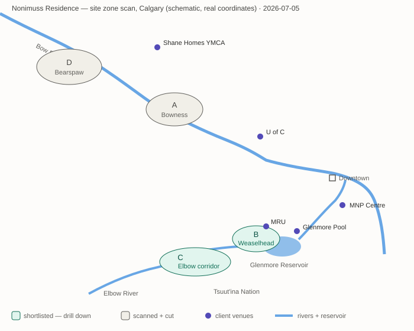

# Site shortlist — zone scan (stage 1 of 2)

*2026-07-05 · Method: client motives → candidate zones → access math → character/jurisdiction check. Distances = straight-line × 1.35 pathway factor, cycling 18 km/h — estimates for ranking only; verify chosen zone with real route data (Google Maps) at drill-down.*

## Selection criteria (from client motives + decisions)
Water adjacency (course brief) · rural feel, trees, minimal-disturbance potential · ≤30 min bike to *regular* venues (his MRU 2×/wk; her MNP + U of C 16×/mo) · garden-worthy sun · views · car access for aging parents.

## Access matrix — estimated one-way cycling time, in minutes
| Zone | MRU (8 trips/mo) | MNP (8 trips/mo) | U of C (8 trips/mo) | Glenmore Pool (1/mo) | Shane YMCA (1/mo) | Total riding, min/mo |
|---|---|---|---|---|---|---|
| A. Bow NW — Bowness/Baker Park fringe | 53 ✗ | 65 ✗ | **29 ✓** | 60 | 24 | 1,367 |
| **B. Weaselhead / Glenmore W edge** | **6 ✓** | **29 ✓** | 40 ✗ | 11 | 81 | **761** |
| C. Elbow corridor — Discovery Ridge / Elbow Valley | **25 ✓** | 50 ✗ | 40 ✗ | 35 | 66 | 1,121 |
| D. Bearspaw (RVC, Bow north bank) | 87 ✗ | 102 ✗ | 66 ✗ | 95 | 29 | 2,348 |

*How to read this table: each cell is the estimated one-way bike ride in **minutes** from the zone to that venue (straight-line distance × 1.35 route factor, at 18 km/h). ✓/✗ marks pass/fail against the 30-minute ceiling for regular venues (8+ trips/mo). The last column totals one-way riding minutes per month if every trip were cycled (trips × minutes, all venues + Arnold's 2 downtown trips) — a single comparable "cost of living there on a bike" number. Example: from Zone B, Arlene's ride to MNP is ~29 min each way, 8 times a month. Zone C row corrected 2026-07-05 after the city's community-boundary data placed Discovery Ridge's true centroid at 51.014, -114.210 — further from MNP than the zone-scan estimate. Verdict unchanged.*

## Zone character & jurisdiction
**A. Bow NW.** Real Bow River frontage possible (Bowness riverfront lots); U of C close. But her MNP and his MRU both fail badly — the geography serves neither career. Urban-residential context. *Verdict: cut.*

**B. Weaselhead / Glenmore Reservoir west edge.** The reservoir is the closest thing to a "lake" in Calgary; Weaselhead Flats (237 ha, Elbow delta) is genuinely wild — balsam poplar forest, wetland. Parcels in SW Lakeview / North Glenmore back directly onto the park above the water. Honest caveats: this is *city edge borrowing wilderness*, not rural; reservoir is protected drinking water (no private waterfront/docks — adjacency means overlooking, via parkland); west shore is Tsuut'ina Nation (not available); land use = City of Calgary R-C1 (verify parcel at drill-down). Access math is exceptional: her hardest commute (MNP) rides the Elbow pathway flat and direct. *Verdict: drill down.*

**C. Elbow corridor.** Discovery Ridge backs onto Griffith Woods (spruce forest on the Elbow River — genuinely river-adjacent, more secluded than B); Elbow Valley (Rocky View County) just west offers true semi-rural riverfront acreages, +10 min everything. MNP and U of C both slightly over ceiling. The most "rural-feeling" option that isn't disqualified. *Verdict: drill down as the rural counterweight.*

**D. Bearspaw.** The classic answer (real rural, real riverfront, RVC R-RUR parcels) — and the math kills it: every regular venue over 60 min by bike, 25–35 min drives. Choosing it means abandoning the bike/walk motive entirely. *Verdict: cut (documented so the client conversation is honest).*

## The trade-off, named
Within a 30-min bike of their working lives, "rural" is not literally available — what is available is *adjacency to protected wilderness* (river valleys, reservoir, urban forest). Zones B and C both buy rural experience (trees, water, wildlife, no overlook) at city-edge addresses. This bends the course brief's "rural site" — defensible in studio as a critical reading: the clients' actual lives contradict the brief's word "rural," and architecture should side with the clients.

## Recommendation
Drill down in **B (first)** and **C (counterweight)**: identify 2–3 real parcels per zone (RVC Atlas / City parcel data / Google Maps), then score parcels on: orientation for sun+views, existing trees, slope, frontage/access, neighbour overlook, land use rules. Decision follows parcel evidence.

## Map

*Schematic zone map: real coordinates, equirectangular projection, not survey scale. Teal = shortlisted, gray = cut, purple dots = client venues.*

## Open items
→ OQ-8 (rural vs. bikeable): resolved in principle by this scan — pending Ben's sign-off on the "wild edge, not rural" reading. New: OQ-10 — does "adjacent body of water" per the course brief accept reservoir/river-valley adjacency via parkland? (Instructor-defensible? Likely yes with the critical-reading argument.)

## Stage 2a — parcel drill-down: land-use verification (2026-07-05)

*Source: City of Calgary Open Data, Land Use Districts dataset (qe6k-p9nh) + Community Boundaries (surr-xmvs), queried live via Socrata API.*

**Zone B verified.** Lakeview's west rim is `S-SPR` (School, Park & Community Reserve — the Weaselhead edge) with residential immediately east; the neighbourhood core is low-density with an `R-CG` infill pocket and multi-res (`M-CG`, `M-C1`) near the commercial node. North Glenmore's south rim mixes `S-SPR`, `DC` (Direct Control) and `M-C1` — DC parcels need individual bylaw lookups.

**Zone C verified — and structurally ideal.** Discovery Ridge: seven `R-G` (Residential – Low Density Mixed Housing) polygons directly against `S-UN` (Special Purpose – Urban Nature = Griffith Woods) and `S-R` (Recreation), with the Elbow River inside the S-UN band. The exact condition the client needs — private low-density land, protected forest, river — exists here as zoned fact.

### Candidate edge bands (parcel picks pending satellite review — stage 2b)
| Band | Zone | Location (approx) | Condition | Land use |
|---|---|---|---|---|
| B-1 | B | Lakeview west rim, ~50.995–51.001 N, -114.125 W edge | Lots fronting park reserve above Weaselhead | R-C1/R-CG vs S-SPR — confirm per parcel |
| B-2 | B | North Glenmore south rim, ~51.006 N, -114.113 | Overlooking reservoir across parkland | DC/M-C1 — bylaw lookup needed |
| C-1 | C | Discovery Ridge south/west edge, ~51.009–51.017 N, -114.19 to -114.23 | R-G directly on Griffith Woods (Elbow R.) | R-G vs S-UN — verified |

### Stage 2b — to do (browser session)
Satellite/street review of each band: pick 2–3 specific parcels; assess orientation (south sun vs. view direction), tree cover, slope, frontage, overlook; confirm street addresses; capture aerial screenshots to `diagrams/`. Then parcel decision + Site-Strategy begins.

## Stage 2b — parcel candidates from satellite review (2026-07-05)

*Method: live Google Maps satellite review via browser. Studio premise: chosen parcel treated as vacant (existing homes ignored — "any real parcel" decision). View links jump to the exact aerial.*

### Finalists

**B-1 · Lassiter Ct SW / Lake Ct SW, Lakeview (Zone B)** — [aerial](https://www.google.com/maps/@50.9915,-114.1335,450m/data=!3m1!1e3)
Cul-de-sac lots backing west into the Weaselhead escarpment forest; mature trees on the lots; picnic-trail network directly beyond the rear line; reservoir below the ridge. Park edge = evening sun in the garden; south sun on the flank; water presence filtered through forest (partial view potential from upper level). Quiet suburban grid, 1960s Lakeview character. **Commutes: the best on the table** — MRU ~6 min, MNP ~29, Glenmore Pool ~11 (761 weighted min/mo).

**C-1a · Discovery Valley Cove SW, Discovery Ridge (Zone C)** — [aerial](https://www.google.com/maps/@51.0080,-114.1985,500m/data=!3m1!1e3)
Valley-floor enclave inside the Elbow valley: south-side lots back directly onto Griffith Woods spruce forest, river ~100 m through the trees, gravel bars and braided channels beyond. Full forest immersion — the most "rural" condition in the city. Flags: valley floor near the river → **floodway/flood-fringe check required**; sun filtered by forest to the south; commutes ~50 min to MNP (1,121 min/mo).

**C-1b · Discovery Dr SW rim lots, Discovery Ridge (Zone C)** — [aerial](https://www.google.com/maps/@51.0102,-114.1985,450m/data=!3m1!1e3)
Ridge-edge lots facing **due south over the Griffith Woods wetland pond and meadow**, Elbow beyond. Sun, water view, and garden slope all in one direction — resolves client contradiction #3 (trees + sun + views) in a single orientation. Walkout-grade escarpment slope; 2000s estate-suburb character; same commute cost as C-1a.

### Scorecard vs client motives
| Motive | B-1 Lakeview | C-1a Valley Cove | C-1b Discovery rim |
|---|---|---|---|
| Bike/walk commutes (decisive per decision log) | ●●● | ● | ● |
| Water adjacency/presence | ●● (reservoir below, filtered) | ●●● (river through trees) | ●●● (pond + river, visible) |
| Rural/wild feel | ●● (borrowed from Weaselhead) | ●●● | ●● |
| Sun for garden + wellness cluster | ●● (W back, S flank) | ● (forest-shaded S) | ●●● (S over meadow) |
| Trees to keep on the lot | ●●● | ●●● | ●● |
| His photography/season-watching | ●● | ●●● | ●●● |
| Risk/regulatory | low | flood check, likely constrained | escarpment setback check |

### Recommendation
**B-1 if the commute decision holds** (it was made deliberately, and 360 extra riding-minutes/month is a real life-cost); **C-1b if the site's architectural offer outranks the daily ride** — it's the better stage for the wellness sequence and the season-watching house. C-1a is the most beautiful and the least defensible (flood + shade + commute). One of B-1/C-1b to be confirmed as *the* site; the runner-up documented as the credible alternative for review day.
