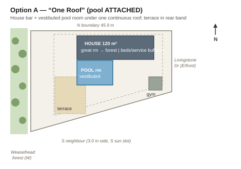
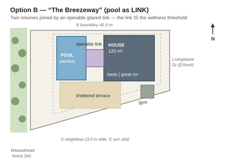

# Massing options — Nonimuss Residence

*Phase 2 (massing) opened 2026-07-25. Site: 6831 Livingstone Dr SW. Read against locked drivers D1–D5, precedent lessons L1–L6, and the site envelope. Three genuinely different options below, scored; recommended direction at the bottom.*

> **Massing Studio (interactive):** open [`Massing-Studio.html`](Massing-Studio.html) — the evolved tool. Steer any volume with sliders and watch the **cap meter** and **driver proxies (D1–D5 + OQ-6 cap-safety)** update live; read a **sun-tested section** (N–S winter/summer rays, E–W forest wall); and see where your live edit lands in the **trade-space plot** against A/B/C. Simpler orbit-only viewer kept at [`Massing-3D.html`](Massing-3D.html); flat plans in `images/Massing-*.svg`.

## The frame (envelope + program the options must obey)

**Envelope (from Site-Details):** buildable ~28.7 × 35.4 m (~1,016 m²); coverage max 45% = **548 m²**; height 11.0 m base, **8.6 m cap in the rear 40%**, no 45° contextual plane at the rear (park district); building depth ≤ 29.8 m; setbacks **3.0 front (E) / 7.5 rear (W, forest) / 1.2 N / 3.0 S**. The rear **7.5 × 32.9 m band is a no-build zone** — it's the wellness-terrace/pool-deck ground, *the pool enclosure if a building must sit outside it.*

**Orientation truths (from the sun study):** E = street/morning sun; W = forest wall, **no direct winter sun to the rear**; S = neighbour, the only winter-noon aperture but not future-proof at grade. So daylight comes from **E + high-S + roof/clerestory**, never the forest face (lesson L1/L5).

**Program:** 120 m² dwelling (hard course cap), single-storey preferred (flat lot makes D5 step-free free); indoor/four-season pool room ~84 m² (6 × 14 m, lap lane + deck); gym outbuilding ~24 m² (OQ-7); 2 covered + 2 visitor parking.

**Coverage math (all three options):** dwelling ~120 + pool ~84 + gym ~24 = **~228 m² = 22% of the lot** — well under the 548 m² / 45% cap. Coverage is *not* a constraint here; the binding constraints are the **120 m² dwelling cap, the 7.5 m rear no-build band, and winter-sun geometry.** Height: all single-storey (~4 m) against an 8.6–11 m allowance — no pressure.

---

## OQ-6 — the cap argument (drafted; this is the move all three options pivot on)

**The problem:** Ben hardened the pool to *indoor / genuinely four-season* (Arlene swims year-round). An enclosed, conditioned pool room is unambiguously a *building*. If it reads as part of the principal dwelling, its ~84 m² blows the 120 m² "developed floor space" cap on its own. The whole parti depends on keeping it *out* of that number.

**The argument, strongest to weakest:**
1. **Accessory-structure reading (recommended).** The 120 m² cap governs the *principal dwelling's* developed floor space. A pool enclosure that is a **separate accessory building** — detached, or joined only by an *unconditioned/operable* link that is not itself dwelling floor area — is an accessory wellness structure, not dwelling floor space. This is the standard planning distinction between a house and its detached/semi-detached accessory buildings (garages, garden studios, pool houses), and it is the cleanest way to hold the cap. **It favours a physically separable pool volume (Options B and C) and works against a single combined volume (Option A).**
2. **Unconditioned/semi-outdoor reading (now weak).** Floor-area definitions often exclude unenclosed or unconditioned space. The 2026-07-05 "semi-outdoor lap pool, excluded from cap" decision leaned here — but the year-round hardening (OQ-6, 2026-07-11) removed the "unconditioned" premise. Keep only as a fallback (a four-season *outdoor* heated pool with operable shelter), not the primary argument.
3. **Below-/at-grade uncovered reading.** N/A — the pool is enclosed.

**Residual to confirm (do not fabricate):** the *course* sets this cap, so the argument is made to the instructor/reviewer, not the City. Before Option A could survive, we'd need the instructor's definition of "developed floor space" — specifically whether a conditioned accessory building counts. **Recommendation: design to the argument that survives the strict reading (separable pool volume), so the parti doesn't collapse if the instructor reads the cap tightly.** This is the single biggest reason the massing leans B/C over A.

---

## Option A — "One Roof" (pool ATTACHED)

- **Parti in one sentence:** A single-storey bar sits across the north/street side as a buffer, its great room opening west to the forest, with the pool room attached and vestibuled under one continuous roof at the forest end.
- **Metrics:** dwelling ~120 m² + attached pool ~84 m² = ~204 m² footprint under one roof; gym 24 m² separate; 1 storey (~4 m). Coverage 22%. Depth ~24 m < 29.8 m limit. ✓ envelope.
- **Zoning check:** pool room, as a building, must clear the 7.5 m rear setback — so the "forest-edge" pool actually sits ≥7.5 m off the line with deck in the band. Fits. Height/coverage/depth all clear.
- **Driver scorecard:**
  - **D1 borrow-the-Weaselhead ~** — house and pool both face the forest, but the attached pool competes with the great room for the prime forest frontage.
  - **D2 wellness-as-event ~** — pool is integral and warm, but reads as "a room in the house," not the *event*; the threshold ritual is weakest here.
  - **D3 winter-is-the-case ✓** — most compact envelope, least heat-loss surface; humidity managed by a vestibule + negative pressure (C6 rules).
  - **D4 sun-designed ✓** — compact bar takes an easy clerestory over the core; house daylight solid.
  - **D5 step-free/zero-corridor ✓** — single mass is easiest to keep corridor-light and step-free; the wet spine to the pool is the one circulation risk.
  - **Cap (OQ-6) ✗ (the killer)** — one enclosed volume containing dwelling + pool is the *hardest* to argue the pool out of the 120 m² cap. Fails the strict reading.
- **Pros / cons:** + warmest, most compact, best winter thermal, simplest to build. − the cap argument is weakest exactly where it matters most; D2 loses its "event" quality.
- **Status:** **parked** (recoverable if the instructor confirms a generous cap reading).

## Option B — "The Breezeway" (pool as LINK)

- **Parti in one sentence:** Two distinct volumes — a compact house and a pool pavilion at the forest edge — joined by a short **operable glazed link** that is the wellness threshold: closed and warm at −20 °C, thrown open to the sheltered terrace in summer.
- **Metrics:** house ~120 m² + pool pavilion ~84 m² + link ~14 m² (unconditioned/operable, not counted as dwelling floor space) + gym 24 m²; 1 storey. Coverage ~24%. ✓ envelope (pool pavilion sits just inside the 7.5 m rear line; house forward of it).
- **Zoning check:** two footprints, both within setbacks; link spans between. Depth fits. ✓.
- **Driver scorecard:**
  - **D1 ✓** — both volumes touch the forest; the gap between them frames a slice of it.
  - **D2 ✓✓ (best)** — the *link is the architecture of the ritual*: swim → cross the operable threshold → sauna/cold → open to garden. This is lesson L3 + P7 Integral's operable wall + the Château-de-cartes fallback, made literal. Passes the swimsuit-at-−20 °C test because the link is enclosable.
  - **D3 ~** — two envelopes = more heat-loss surface than A; the link must be a *properly insulated operable* threshold, not a cold breezeway, or it's a winter penalty.
  - **D4 ✓** — house volume stays compact and clerestory-lit; pool gets sky-light from the roof (L5).
  - **D5 ~** — the link risks reading as a corridor (violates zero-corridor) and must stay step-free between volumes; needs care in test-fit.
  - **Cap (OQ-6) ✓✓** — pool is a physically separate structure joined by non-dwelling link → the accessory-building argument holds under the strict reading.
- **Pros / cons:** + resolves the central conflict (cap-safe *and* four-season *and* the ritual becomes the building); + directly banks the precedent lessons. − demands that the link be detailed as a real insulated operable threshold (hardware — OQ-15); slightly more envelope to heat than A.
- **Status:** **active — recommended** (see below).

## Option C — "House & Pavilion" (pool DETACHED)

- **Parti in one sentence:** A compact buffer-zone house set forward toward the street (best morning/south sun) and a freestanding pool pavilion at the forest edge, separated by a sheltered court.
- **Metrics:** house ~120 m² + detached pool ~84 m² + gym ~24 m² (can attach to the pavilion); 1 storey; court ~10 × 6 m. Coverage ~24%. ✓ envelope.
- **Zoning check:** three footprints (house, pavilion, gym), all within setbacks; pavilion just inside the rear band. ✓.
- **Driver scorecard:**
  - **D1 ✓** — the pavilion sits *hard on* the forest edge (strongest forest contact); house is one step back.
  - **D2 ✗ (the weakness)** — the sequence must cross an **open court** to reach the pool. At −20 °C in a swimsuit, an uncovered court fails the D2 test. Covering the court to fix it turns C into B.
  - **D3 ✗** — three separate small envelopes = the worst winter thermal of the three.
  - **D4 ✓✓ (best)** — house set forward, away from the forest shadow, gets the cleanest E-morning + high-S winter light; daylight is best here.
  - **D5 ✓ / ✗** — the house itself is a clean compact single mass (good), but the wellness sequence is not a unified step-free experience (outdoor crossing).
  - **Cap (OQ-6) ✓✓✓ (best)** — a fully detached accessory building is the *least* arguable as dwelling floor space; the cap argument is airtight.
- **Pros / cons:** + safest cap argument and best house daylight; + clearest, most legible site composition. − fails the −20 °C wellness test unless the court is enclosed (at which point it's B); worst winter energy.
- **Status:** **parked** (the cap-safe extreme; recoverable if the pool use relaxes to warm-season-primary, or as the fallback if B's link can't be detailed).

---

## Recommended direction — **Option B ("The Breezeway"), refined**

The three options trace one axis: **cap-safety rises A → B → C, but four-season wellness performance falls C → B → A.** The two ends each sacrifice a locked driver — A sacrifices the cap argument (OQ-6, the load-bearing move), C sacrifices D2 (the swimsuit-at-−20 °C test, the *event*). **Option B is the hinge that keeps both:** a physically separate pool structure (C's cap strength) joined by an *operable insulated threshold* that keeps the swim–sauna–cold–garden sequence warm and continuous in January (A's warmth) — which is exactly precedent lesson L3 and the operable-wall move proven by Integral House (P7) and held in reserve since the 2026-07-11 pool decision.

**Refinements to carry into space planning (they fix B's two soft scores):**
- **Make the link a real threshold, not a corridor (fixes D5).** It should be an inhabited transition — bench, gear, the cold-plunge moment — wide and occupiable, so it does ritual work rather than reading as circulation. Zero-corridor stays intact if the link is a *room-you-pass-through*, not a hall.
- **Insulate and operate the link for winter (fixes D3).** Triple-glazed operable panels; closed it's a warm vestibule between two conditioned volumes (satisfies the C6 negative-pressure/vestibule rule for the pool), open it dissolves to the summer terrace and admits breeze (the mosquito/wind seasonal strategy from Site-Details).
- **Push the house volume forward/east** so it takes E-morning and high-S winter light (borrowing C's D4 win) while the pool pavilion holds the forest edge (D1).

This is the *best* option, not merely the safest — C is the safest and it breaks D2. The trade B accepts (a bit more envelope to heat than A) is the right one because D2 is the project's signature and OQ-6 is non-negotiable.

---

## Phase gate — 2026-07-25 (skeptic pass)

- **What breaks if the program grows 15% (120 → ~138 m²)?** The lot doesn't care (coverage is only 22%), but the 120 m² is a *hard course cap* — it can't grow. So the real test is where pressure goes. **B is most resilient:** the pool/wellness (~84 m²) already sits outside the cap, so growth pressure lands only on the dwelling and can borrow from a generous site or the link. **A is least resilient** — everything huddles under one near-capped roof.
- **Which option is most resilient to the top open question (OQ-6)?** B and C both survive a *strict* "developed floor space" reading; **A dies** under it. Since OQ-6 is the load-bearing move and its resolution is still the instructor's to give, designing to the option that survives the strict reading is the prudent call — B or C, not A.
- **Is the recommendation the best or the safest — and is that the right trade?** C is the safest (airtight cap, best daylight) but it breaks D2 at −20 °C. B is the *best* — it keeps D2 and the cap both — at the cost of a little more envelope to heat. Given D2 is the signature driver, choosing best over safest is the right trade here. If B's operable link proves undetailable at local-trades budget (OQ-15), **C is the named fallback**, not A.
- **Hardest question a reviewer will still ask:** "You've moved 84 m² of heated, humid, glazed pool into an 'accessory building' to dodge a 120 m² cap — isn't that just gaming the number?" The honest answer must be that the pool is *programmatically* separate (a training facility, used differently, conditioned differently per C6) and *architecturally* separate (its own volume + threshold), not a bedroom relabelled. B has to earn that reading in the detailing, or the whole argument looks like a loophole.

**Open questions touched:** OQ-6 — cap *argument drafted* (accessory-structure reading); resolves the "how," leaves the instructor's definition confirmation open → carries to space planning + review. OQ-15 (operable threshold) — now *central*, not peripheral: it's the mechanism the recommended parti depends on → carries to space planning + materiality. OQ-16 (D5 zero-corridor) — B's link is the specific risk; the "room-you-pass-through, not a hall" refinement is the answer to test in phase 4. OQ-7 (gym) — placed as a small outbuilding / pavilion-attached in all options; still Ben's call to confirm.

**Verdict:** Three genuinely different options generated, numbered, and scored; recommended direction is **Option B refined**, with C as the explicit fallback and A parked pending a generous cap reading.

**DECISION 2026-07-25 (Ben): Option B "The Breezeway" LOCKED** as the basis for space planning. A parked (generous-cap-reading only); C parked as the named fallback. Logged to decision log. Carry the three refinements (inhabited link, insulated/operable threshold, house pushed east) into phase 4.
