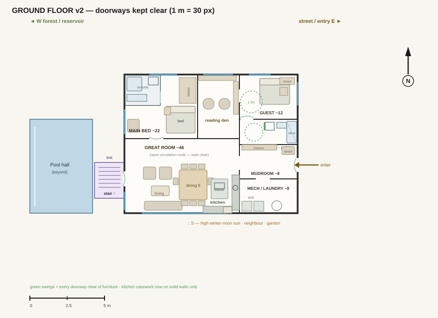
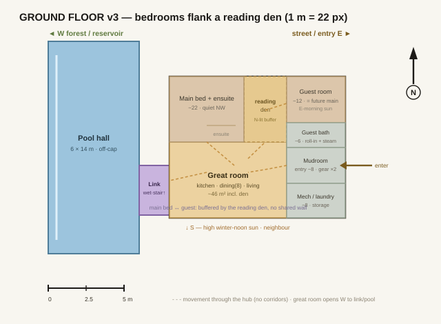
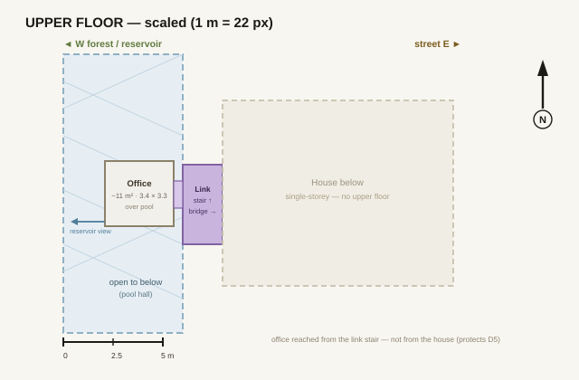
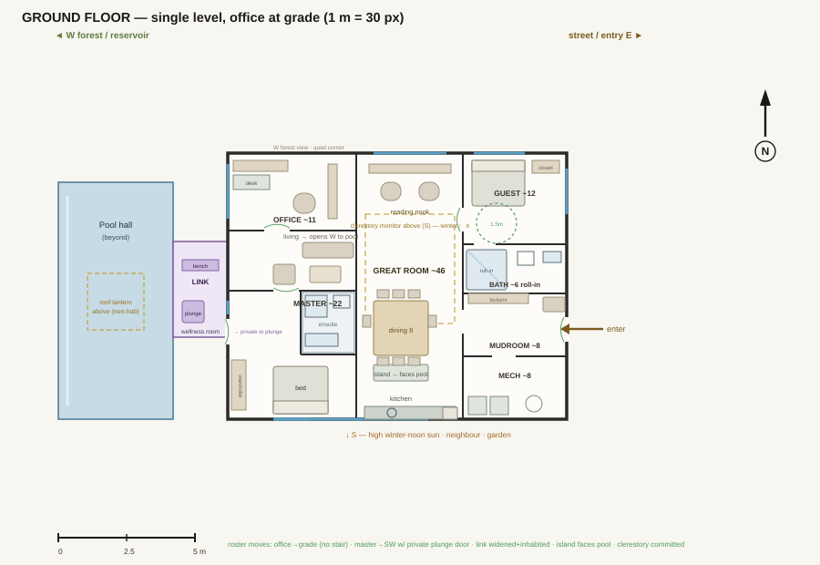
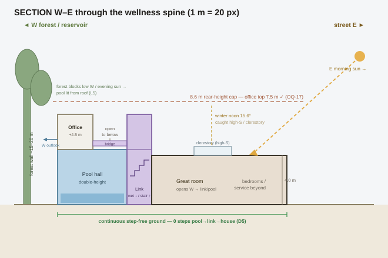
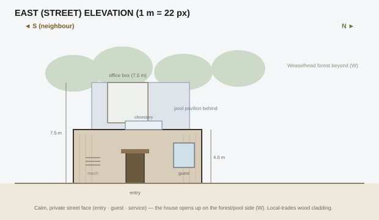

# Program test fit — Nonimuss Residence

*Phase 4 opened 2026-07-25. Basis: Option B "The Breezeway" (LOCKED), two-storey. Geometry pulled from `3_Massing/Massing-Studio.html`. Program areas are the brief v0.3r ⚠ working estimates (Ben: proceed on estimates, adjust in-fit). Read against drivers D1–D5 and OQ-5/6/15/16/17.*

## Level scheme (from the massing)

Pulled directly from the Option B box geometry, then resolved with two decisions (see decision log 2026-07-25):

- **Ground level** — the **house** (single storey, ~98 m² plate, east), the **pool hall** at grade (6 × 14 m ≈ 84 m², west, double-height), and the **link** at grade (the *wet* wellness threshold between house and pool).
- **Upper level** — **Arnold's office** (the ~11–15 m² "white box" over the **west/link end** of the pool, reservoir view W, acoustic separation), the **open-to-below void** over the rest of the pool hall, and the **upper link** (the *dry* stair + short bridge up to the office).
- **Vertical circulation** lives **in/beside the link**, not in the house — keeps all stairs out of the 120 m² dwelling and off the step-free core (D5). The link therefore does double duty: ground = wellness pass-through; upper = stair/bridge to office.

## Reconciled program

| Space | Count | Unit m² | Total m² | Floor | Adjacency / driver notes |
|---|---|---|---|---|---|
| Great room (kitchen/dining/living + reading den) | 1 | ~46 ⚠ | ~46 | Ground | The hub — everything opens off it (zero-corridor). Social K/D/L in the S body opens W to link/pool (D2) + high-S winter light (D4); a **north-lit reading den** arm reaches up between the two bedrooms as their buffer |
| Main bedroom + ensuite | 1 | ~22 ⚠ | ~22 | Ground | Quiet, forest (W) outlook (D1); reached off the hub with an acoustic buffer, not a corridor; keep clear of pool humidity |
| Guest / family room | 1 | ~12 ⚠ | ~12 | Ground | Step-free; near the core; doubles as future main-bedroom (aging-in-place) |
| Guest bath | 1 | ~6 | ~6 | Ground | **Wheelchair roll-in (barrier-free) + steam** — future-proofs the guest room's aging-in-place / future-main role (D5). +1 m² vs brief, taken from the notional circulation line |
| Office (Arnold) | 1 | ~11 (10–12) | ~11 | **Upper** | White box over pool; reservoir view + acoustic separation (OQ-5); own on-cap volume (OQ-17) |
| Mudroom / entry airlock | 1 | ~8 ⚠ | ~8 | Ground | Arrival sequence starts here; two households' gear; route to both hub and pool |
| Mech / laundry / storage | 1 | ~8 ⚠ | ~8 | Ground | Service cluster with the mudroom |
| Circulation | — | — | ~8 | Ground | Target ≈ 0 dedicated corridor (D5) — absorbed into the hub; 1 m² reallocated to guest bath |
| **Dwelling total** | | | **~120** | | Hard course cap |

**Off-cap (accessory / unconditioned / outbuilding):** pool hall ~84 m² (Ground, double-height); link/threshold ~14–16 m² (operable, not dwelling floor area — OQ-6); gym outbuilding ~24 m² (OQ-7); sauna/steam folded into the guest bath (OQ-9); parking 2+2 + bike store.

**Fit check (first pass):** ground dwelling rooms ≈ 109 m² vs the massing house plate ≈ 98 m² → **house plate is ~11 m² short** for a zero-corridor ground floor. Lot has ample room (coverage only ~22%, well under the 45% cap), so the cleaner move is to **grow the house plate ~11 m²** (≈ 15 × 7.3 m) rather than trim program; office box trims from 15 → ~11 m² upstairs. Net dwelling ≈ 120 m², within cap and envelope. *To confirm against verified areas.*

## Furnished ground floor (client-meeting rough, 2026-07-25)

Bubbles taken to a rough furnished layout for a client conversation: walls with door swings and glazing (blue); dining for eight and living in the great room opening W to the link/pool; reading den with shelves and chairs; main bed with ensuite + closet; **accessible guest room and roll-in bath drawn with 1.5 m wheelchair turning circles**; mudroom with lockers/bench at the street entry; W/D + tank in mech; and the link stair up to the office. Furniture is schematic (concept-grade) — for discussion, not construction.

**v2 fix (2026-07-26, Ben caught it): furniture was blocking doorways.** The first furnished pass ran the kitchen casework along the great room's north and east walls — the two walls carrying the most doorways (den, main bed, mudroom) — blocking circulation. Corrected by furnishing **circulation-first**: every opening + swing reserved, door-to-door paths kept clear, then furniture placed in the leftover pockets, with **fixed casework on solid opening-free walls only** — the kitchen moved to the SE corner (below the mudroom door, backing the mech wall for plumbing). Door swings are now drawn on the plan (green) so the clearance is visible. **This was generalized into a skill rule** — see `_skill-source/references/phase-4-space-planning.md` "Furnishing a test-fit — circulation FIRST" and backlog #20.

## Scaled plans (block versions, 2026-07-25)

Rooms sized to furniture + clearances and laid into the house plate. **Orientation (from Site-Details):** N up, street/entry E (right), forest/reservoir W (left), neighbour S (down); reliable sun E-morning + high-S winter. **House plate refined** from the schematic massing bar (14 × 7 m) to a squarer **~11.6 × 9.3 m ≈ 108 m²** to support the zero-corridor hub — same area class, coverage still ~21%; feed this footprint back to the Massing Studio. **Zero-corridor (D5):** all rooms open off the great-room hub; movement is through the hub, no dedicated corridor.

**v3 revision (2026-07-25, Ben): bedrooms in opposite north corners, a reading den between them.** The east service stack (guest room / bath / mudroom / mech) was mirrored top-to-bottom so the **guest suite sits in the NE corner** (mech drops to the SE). **Main bed holds the NW corner; the great room reaches up between the two bedrooms as a north-lit reading den** — an occupied buffer, so the two bedrooms have no shared wall while staying on one step-free level. The social kitchen/dining/living stays in the south body, opening W to the link/pool and taking high-S winter sun. Guest room keeps E-morning light with its accessible bath immediately beside it; entry/mudroom stays mid-east (off the cold N/NE corner); the link meets only the great room, keeping pool humidity off the bedrooms. **Honest note:** the pool pavilion sits between the house and the open forest, so the main bed's W outlook is a *pool-court / filtered-forest* view, not open Weaselhead — the house borrows the forest mainly through the great room's W opening + the link, and now the north reading den (D1).

*(Superseded v2, where the guest suite sat in the SE corner separated by the full hub — replaced at Ben's request with the mirrored, den-buffered arrangement.)*

## Roster review + office-at-grade variant (2026-07-26)

The three-voice roster was run on the furnished plan. Threads: **Client** — the wellness route crossed the great room, and the office sat up a stair over a humid pool; **Studio Critic** — the link had become a stair-spine (breaking zero-corridor / OQ-16), and stacking the office on the off-cap pool building muddied the cap (OQ-17) and likely needed a second egress + vapour separation; **Design Collaborator** — converted these to moves.

Answerable moves (incorporated): **master → SW with a private door to the link** (wellness route no longer crosses the social heart); **link widened + inhabited** (bench, cold plunge); **kitchen island turned to face the pool**; **clerestory committed** as a real S-facing monitor for winter sun.

Dangerous thread → **office-at-grade variant.** The office-over-pool carried humidity + egress + cap-purity at once, so the fallback was drawn: **office to grade (NW corner), the box over the pool becomes a non-habitable roof lantern, and the stair disappears** — single-storey. This resolves all three risks and reinforces D5, losing only the (canopy-filtered) elevated view. It reverts the two-storey massing decision, so it's logged as **OQ-18** for Ben to weigh against two-storey B.

## Rough section + elevation (2026-07-25, two-storey baseline)

**Section (W–E through the wellness spine)** tests the whole two-storey idea in one cut and it holds: the office top sits at **7.5 m, under the 8.6 m rear-height cap (OQ-17 ✓)**; the pool hall reads as a genuine double-height volume with the office floating over its west end and a void beside it; the link is a true two-storey threshold (wet below, stair + bridge above); and the **ground datum is continuous and step-free from pool → link → house (D5 ✓)**. Sun logic drawn from Site-Details: the forest wall blocks low west/evening sun so the **pool is lit from the roof (lesson L5)**, the great room takes **E-morning sun**, and **winter-noon sun (15.6°) is caught high via the clerestory** rather than at grade (the neighbour blocks grade-level winter sun — D4).

**East (street) elevation** shows the design's public/private split: a **calm, mostly-solid single-storey street face** (entry, guest window, mech, clerestory peeking over the roof), with the taller **pool pavilion + office box rising behind** toward the forest — the house saves its glass for the W forest/pool side. Local-trades wood cladding.

**Open items surfaced by the section:** (a) the office's elevated W outlook is over the pool court and *through/над* a 15–20 m tree canopy — a filtered/partial reservoir view, not a clear one; confirm at survey with real tree heights (ties to OQ-13). (b) The clerestory doing the winter-sun work needs its geometry checked against the actual roof pitch in massing. (c) The pool pavilion is N–S longer (14 m) than the house (9.3 m), so it reads beyond the house edges on the street face — a massing-refinement to reconcile.

## Adjacency matrix

●=required · ○=preferred · ✗=keep apart · ▲=stacked (vertical)

| | GR | MB | GU | GB | MU | ML | LK | PL | OF |
|---|---|---|---|---|---|---|---|---|---|
| **GR** great room | — | ● | ● | ○ | ● | ○ | ● | ○ | ✗ |
| **MB** main bed+ensuite | ● | — | ✗ | ✗ | ✗ | ○ | ✗ | ✗ | ✗ |
| **GU** guest room | ● | ✗ | — | ● | ○ | ✗ | ✗ | ✗ | ✗ |
| **GB** guest bath | ○ | ✗ | ● | — | ✗ | ○ | ✗ | ○ | ✗ |
| **MU** mudroom/entry | ● | ✗ | ○ | ✗ | — | ● | ○ | ○ | ✗ |
| **ML** mech/laundry | ○ | ○ | ✗ | ○ | ● | — | ✗ | ✗ | ✗ |
| **LK** link/threshold | ● | ✗ | ✗ | ✗ | ○ | ✗ | — | ● | ▲ |
| **PL** pool hall | ○ | ✗ | ✗ | ○ | ○ | ✗ | ● | — | ▲ |
| **OF** office (upper) | ✗ | ✗ | ✗ | ✗ | ✗ | ✗ | ▲ | ▲ | — |

Reading: the **great room is the hub** (required to bedroom, guest, mudroom, link). The **office is deliberately separated** (own view, acoustic quiet — OQ-5) and reached only ▲ up through the link. The **main bedroom is kept off the pool/humidity and off circulation**. The **link is the only required bridge** between dry house and wet pool.

## Stacking

| Level | Program | Approx m² |
|---|---|---|
| Upper | Office (over pool W/link end) + open-to-below void over pool + link stair/bridge | office ~11 (+ void) |
| Ground | Great room, main bed+ensuite, guest room + bath, mudroom, mech/laundry (house) · pool hall · link (wet) | dwelling ~109 + pool ~84 |

## Functional area verification (bottom-up, 2026-07-25)

Each room tested against furniture footprints + clearances (wheelchair turn 1.5 m dia; walker path ~0.9 m; two-cook kitchen aisle 1.2 m; dining chair pull-out ~0.9 m). Functional-minimum vs. allocated:

| Room | Alloc m² | Func-min m² | Verdict |
|---|---|---|---|
| Great room (K + dining-8 + living + reading/music) | 45 | ~37 | Comfortable |
| Main bed + ensuite | 22 | ~19 | Comfortable (~3 slack) |
| Guest room (as accessible future main bed) | 12 | ~11 | Adequate — wheelchair-turnable, not generous |
| Office (books + edit + guitar) | 11 | ~9.5 | Comfortable (~1.5 slack) |
| Mudroom / entry (two households' gear) | 8 | ~7.5 | Adequate if full-height lockers |
| Guest bath (barrier-free + steam) | 5 | ~6 | **UNDER for full wheelchair roll-in** (OK at 5 for walker/ambulant) |
| Mech / laundry / storage | 8 | ~8.3 | **Tight** — OK only if pool dehumidification sits in the pool building |

**Conclusion:** the arrangement is functionally sound; 5 of 7 rooms clear comfortably. Two to resolve (below). Slack to fix them exists without breaking the 120 m² cap: office ~1.5, main bed ~3, and the ~9 m² circulation line (largely notional in a zero-corridor hub), plus the planned ~11 m² house-plate growth.

- **OQ-5 office size** — desk-only (~9 m²) vs print/edit (~12 m²), sized against cap slack once ground areas verify.
- **OQ-16 link-as-room** — the link carries the stair *and* must still read as an inhabited threshold (bench, gear, cold-plunge), not a hall. Test that the stair doesn't turn it into circulation.
- **OQ-17 office cap-purity** — office must read as its own on-cap dwelling volume bridging up, distinct from the off-cap pool building, and clear the 8.6 m rear-height cap (office top ≈ 7.5 m).
- **Fit delta** — grow house plate ~11 m² vs trim program (above); confirm against verified brief areas.
- **Guest bath accessibility level** — RESOLVED 2026-07-25: wheelchair roll-in (barrier-free), ~6 m², to future-proof the aging-in-place suite (D5). +1 m² from the circulation line.
- **Pool mech location** — RESOLVED 2026-07-25: pool dehumidification/plant lives in the pool accessory building, off-cap; dwelling mech room holds house HRV/HW/laundry/storage only (8 m² holds).

## Reconciliation notes
*(Where brief and massing disagree and what gives way — feed changes back to the brief version + decision log.)* First tension logged above (house plate vs ground dwelling). Nothing folded back to the brief yet — pending the bubble/adjacency review and area verification.

## Phase gate — 2026-07-26 (skeptic pass, phase PAUSED not closed)

**Driver scorecard (office-at-grade variant):**
- **D1 borrow-the-Weaselhead ~** — the house borrows the forest through the great room's W opening + the link + (grade variant) the NW office's forest view; direct forest views are limited because the pool pavilion sits between house and forest. Adequate, not strong.
- **D2 wellness-as-event ✓✓** — the link is the ritual room; the grade variant gives the master a *private* plunge route that no longer crosses the social heart. Strongest driver.
- **D3 winter-is-the-case ~** — compact single-storey + committed clerestory help; the operable link detailing (OQ-15) and envelope still to prove.
- **D4 sun-designed ✓** — great room S glazing + clerestory monitor + E-morning; grade office gets W/forest light.
- **D5 step-free / zero-corridor ✓✓ (grade variant)** — no stair, hub circulation, accessible guest suite with 1.5 m turns. (Two-storey version was only ~ because of the daily stair.)

**Hardest questions a reviewer/client will still ask:**
1. The whole test-fit rests on the **⚠ unverified program areas** — verify against the RAIC 350 course brief before committing.
2. **Single-storey vs two-storey (OQ-18)** is unresolved and changes the section, elevation, cap argument, and massing.
3. The **house plate grew to ~120 m² on one level** — re-check footprint/coverage/setbacks in the Massing Studio.
4. The pool pavilion is **longer N–S than the house**, so it reads past the house on the street face — a massing reconciliation.

**Resolved this phase:** functional areas verified; furnishing corrected to circulation-first (doorways clear); master↔guest separation; accessible guest suite + roll-in bath; level scheme; two comparable schemes drawn.
**Raised / carried:** OQ-18 (storey count — the key fork), plus the massing feedback items above. **Upper-floor furnishing intentionally skipped** (this was a method test, not a full set).

**Gate verdict:** space planning is at a coherent client-meeting state and is **paused, not closed** — the deciding fork is OQ-18. Resume by choosing a scheme, verifying areas, then looping the winner back to massing.

## Test-Fit Studio (built 2026-09-08)

**[Test-Fit-Studio.html](Test-Fit-Studio.html)** — the interactive instrument from `phase-4-space-planning.md`, seeded with the ground floor of this project's current (roster-reviewed) reconciled program: 8 room instances, the adjacency matrix above, a hub-clearance check on the Great Room's four walls, and a fixed-casework/door-swing collision check. Two scenario buttons: **Current (safe)** loads the kitchen casework on GR's north wall (door-free since the master moved to the SW per the 2026-07-26 roster review); **Demo: casework on a door** deliberately moves it onto the GR↔Mudroom doorway to show the live check catching it.

**Updated same day, after first feedback ("needs more love," "can't zoom out," "how does this deal with multiple floors").** The Studio gained: a **Ground/Upper level tab** (the office, upper link/stair-bridge, and an illustrative open-to-below void over the pool are now modeled on their own Upper tab, reachable only via the office↔upper-link pair — cap meter now reports Ground, Upper, and the combined full-dwelling total, 113.2/120 m²); **windows and the front entry** as a distinct opening type from doors (south glazing for winter sun D4, a west window off the main bed for the filtered forest/pool-court view D1, an east window at the guest room for morning light, the office's west reservoir window, all seeded from driver language already in this doc, not invented) with a *soft* casework-vs-window conflict note separate from the hard casework-vs-door violation; and **pan/zoom (mouse wheel + drag-empty-canvas) plus collapsible side panels**, since the fixed panels were hiding geometry at the canvas edges with no way to see behind them. This changed what "Test-Fit Studio v1" means — `phase-4-space-planning.md` and the packaged skill were updated to match (multi-floor moved from "deferred" to "built, via level tabs, not true 3D stacking").

**Updated again same day, second round of feedback** ("needs a bit more love," "make windows stretchable," "add a palette to place new windows and doors," "delete doors and windows," "add a schematic stair"): doors and windows now each carry two square stretch handles (drag either end to change width, the other end stays put) in addition to the existing round slide handle; a red × on each deletes it; a new "Add opening" palette (door/window/entry type, room, wall — both scoped to whichever level tab is open) drops a new one at that wall's midpoint. The upper link (`LKU`) now renders simple tread hatching + a "STAIR" label — a location marker only, not a calculated stair (no rise/run/going check). Folded into `phase-4-space-planning.md` and repackaged, same as the first round, since this is now what "stretchable/deletable openings" and "a schematic stair marker" mean for the tool generally, not just this file.

**Stair glyph rebuilt, third round of feedback same day** ("doors and windows working great, however the stair is lacking big time... I should see it both on the ground and upper levels because that's an interconnected space... improve the appearance... just filling the box with lines isn't good enough"): replaced the box-filled-with-lines placeholder with a real plan-stair symbol — a ~1 m-wide stair run inset within the room (not the room's full footprint), tread lines at a fixed schematic spacing (proportional to run length, not a fixed count), a break-line convention marking where the flight continues past the plan cut, and a direction arrow labeled UP/DN. It now renders in **both** `LK` (Ground) and `LKU` (Upper), since it's the same interconnected run. Honest limitation: because level tabs are a flat switch, not true 3D stacking, the two glyphs aren't guaranteed to sit at literally the same X/Y between floors — placed each at a reasonable position within its own room rather than forced into false alignment. Folded into `phase-4-space-planning.md` and repackaged.

**Stair made grabbable, fourth round of feedback same day** ("stair definitely looks better... can we make the stair grabbable so I can move it around and rotate it... if I wanted to make LKU bigger I may want to move the stair around within the bigger space"): the stair glyph is now its own draggable object within its room (a background handle you can grab and drag anywhere inside the room's current bounds) plus a small ⟳ rotate button that swaps its width/height around its own center — a 90° reorientation, not arbitrary-angle, which is enough to turn a run to fit either way without adding angled-tread math. It doesn't auto-follow if you resize the room bigger via the room's own corner handle — you reposition it afterward, which is the two-step move Ben's own example described. Folded into `phase-4-space-planning.md` and repackaged.

**Save/Load/Sync added, fifth round of feedback same day**, after Ben lost an edit session to a closed tab and asked how the two Studios were meant to connect (a Fable-model take recommended against merging them — see `HANDOFF.md` 2026-09-08): the Studio now has real file-based **Save**/**Load** for its own state (fixes the actual "closed the tab" problem, unlike the old clipboard-based export) and a **Sync from massing** button that reads whatever Massing Studio's new "Save for Test-Fit sync" button wrote, replacing the hand-typed `GROUND_CAP`/`DWELLING_CAP_FULL` placeholders with live numbers. **First real finding from building this:** Massing Studio's own scheme-B House volume is still 14×7 m (98 m²) — the original schematic bar — while this doc refined the house-plate footprint to ~108 m² back on 2026-07-25 and asked for it to be fed back into the Massing Studio, which never happened. The first real sync will surface that gap directly rather than silently agreeing with the placeholder. Not fixed yet — Ben's call whether to update the massing scheme now that there's a live way to see the drift.

**Honest scope notes:**
- **This does not reproduce the exact original v2 casework mistake.** By the time of the 2026-07-26 roster review, the main bedroom had already moved from the NW corner (its v3 position, when the north-wall casework problem was real) to the SW corner — so this Studio's geometry reflects the *current* plan, where the north wall is door-free for an unrelated reason. The "Demo" scenario instead shows the same live check catching a *constructed* violation (casework moved onto the real GR↔Mudroom door) — a demonstration that the mechanism works, not a literal historical reenactment.
- **A real discrepancy surfaced while seeding this:** the adjacency matrix above marks **MB✗LK** (keep apart), but the 2026-07-26 roster review's "master → SW with a private door to the link" was incorporated into the current design — meaning the matrix row is stale. The Studio models the private door (current design) and flags this contradiction on-screen rather than silently picking a side. Worth reconciling the matrix table above next time this phase reopens.
- **Two schematic-layout artifacts, not real design findings:** the Guest Bath↔Mudroom pair (✗ in the matrix) computes at 0.3 m apart, and Guest Room↔Great Room (required) computes at exactly the 1.0 m threshold. Both are almost certainly just this schematic block-packing being tight, not evidence of an actual problem — flagged in the tool's own footer rather than hidden.
- **Verified at the logic level, not in a browser.** No browser-automation tool was available this session (same gap as the weekend Project Window work), and this machine has neither Node nor a JS engine on PATH — both verification passes (initial build, and the windows/levels update) were done by porting the pure geometry/adjacency/clearance functions line-for-line into Python and running them against the exact seeded data. Confirmed: all 7 required-adjacency pairs pass; the OF↔LKU upper-level pair touches (gap 0); every other OF-row pair correctly shows as "different levels — not evaluated" rather than a fabricated number; combined on-cap dwelling area lands at 113.2/120 m², matching this doc's own "~120 m²" figure; the "Current" scenario shows zero casework violations against both doors and windows; the "Demo" scenario correctly flags its constructed door violation with the expected overlap; all 5 seeded windows/entry fit within their assigned wall's extent with no overflow. One real bug was caught and fixed by re-reading the file rather than running it: the left-panel help text originally claimed casework re-snaps to the nearest wall on drop, which the drag code never actually implemented — corrected the text to match what the code does (slides along its assigned wall only, like a door) rather than leave a false claim in a tool built to be honest about its own limits. The drag/resize/pan/zoom/level-tab interaction code itself has **not** been clicked through for real yet.
