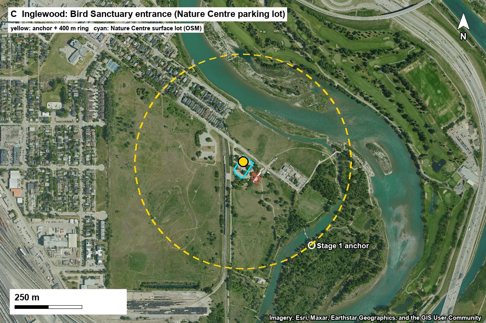
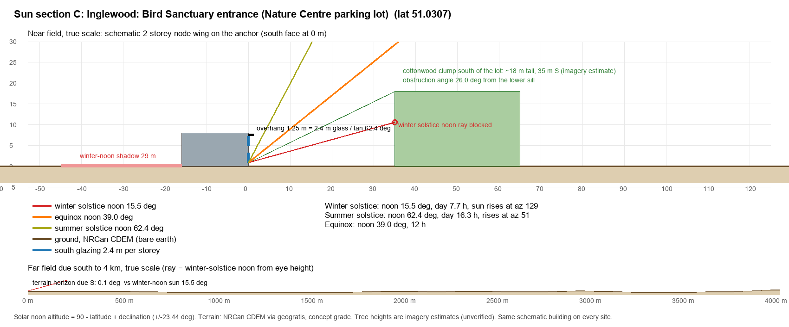
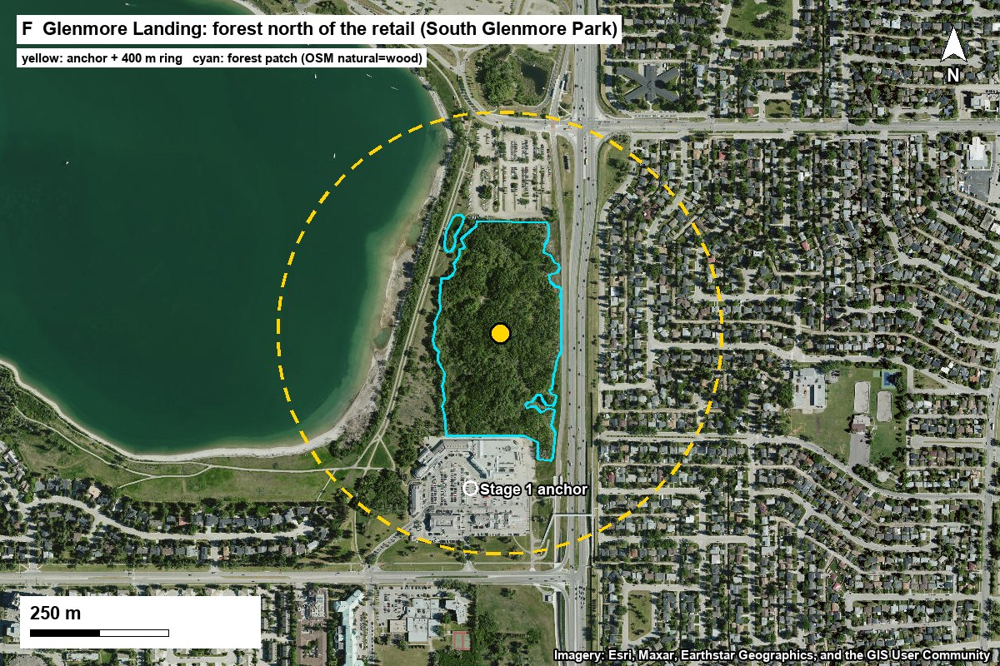
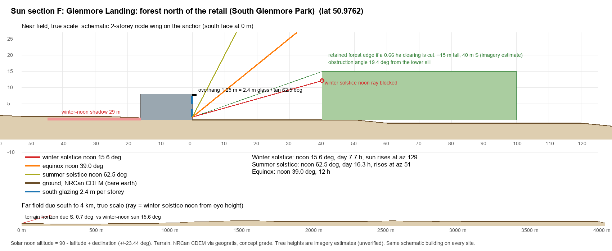
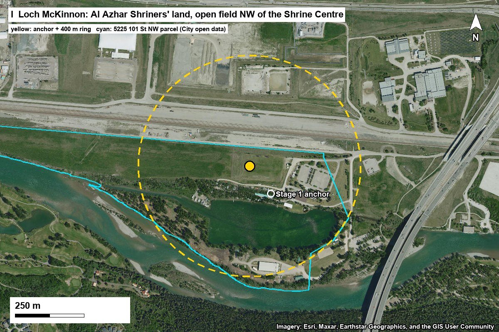
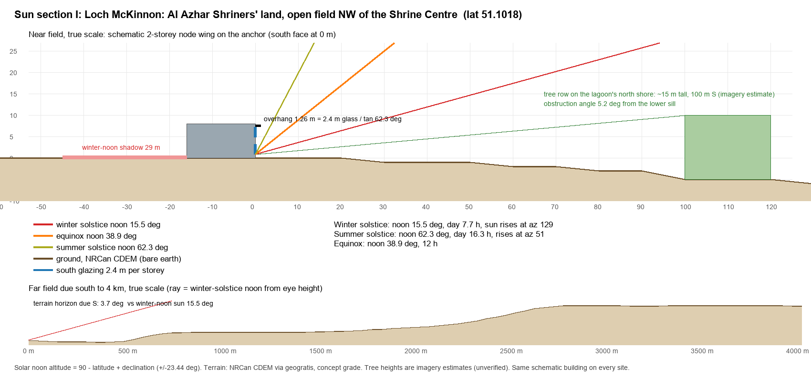
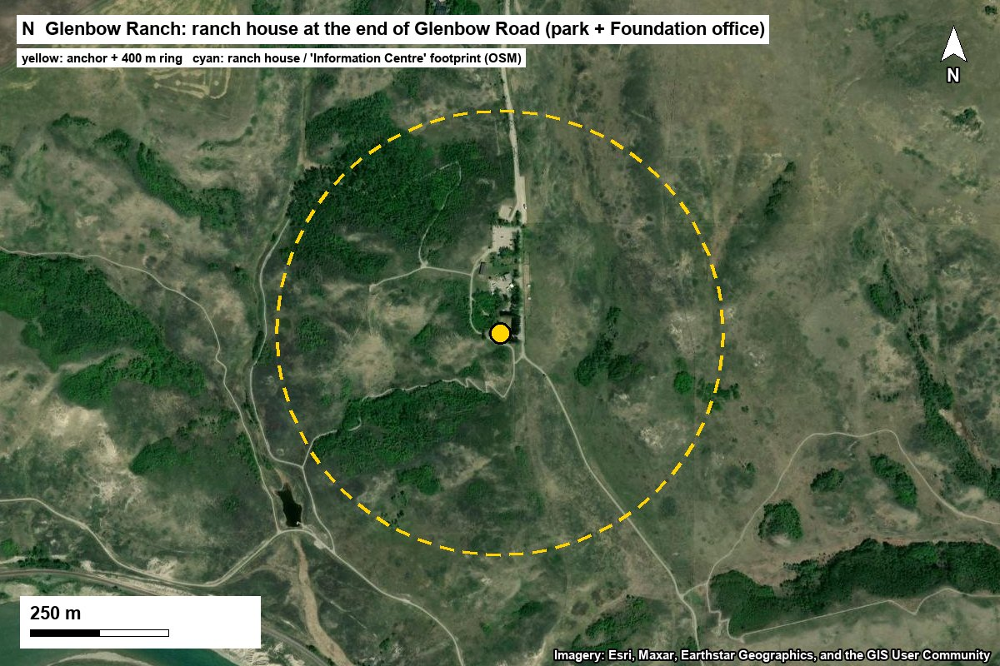
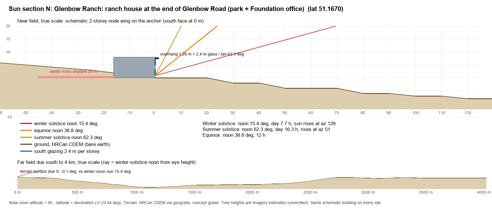

# Stage 2: four-site study (C, F, I, N)

*Cairn Youth Centre, RAIC 400. Drafted 2026-09-29 on Ben's four picks. Method: `_skill-source/references/phase-2-site.md` (Stage 2 parcel scorecard with envelope utilization, facts before moves, the assessment battery, the two-ring scan). Every number comes from `data/stage2_scan.py` → `data/stage2_2026-09-29.json` (self-contained per site; narrative in `data/stage2_narrative.py`). This is coursework on a fictional client: "verified" means checked against a public dataset, not a survey, title search or City conversation.*

## Summary

### Ranking: Stage 1 criteria and weights, plus the Stage 2 envelope column

| Rank | Site | Setting | Mtn ×2 | City ×2 | Land ×2 | Room | Coach | Haz | Serv | **/50** | Stage 1 | Envelope: site-need ratio | Entitlement |
|---|---|---|---|---|---|---|---|---|---|---|---|---|---|
| 1 | **F** Glenmore Landing | city | 2 | 4 | 3 | 5 | 5 | 4 | 5 | **37** | 38 | 0.32 comfortable (north-edge lots) | S-R / S-SPR regional park, mapped natural area |
| 2 | **C** Inglewood | city | 1 | 5 | 4 | 3 | 4 | 4 | 5 | **36** | 32 | 0.94 tight | S-R park lot: redesignate; replace sanctuary parking |
| 3 | **I** Loch McKinnon | city | 2 | 4 | 3 | 5 | 4 | 4 | 5 | **36** | 35 | 0.02 comfortable | S-FUD private land: buy/lease + redesignate |
| 4 | **N** Glenbow Ranch | rural | 1 | 3 | 4 | 5 | 2 | 5 | 1 | **29** | 32 | 0.67 fits (facility zone) | Provincial park: needs the new management plan |

Tie-break (Mountains + City + Landscape, then Hazards) puts C (10) ahead of I (9) at 36.

Key drive times (OSRM free-flow minutes from the Stage 2 anchors; add 20–40% for peak or winter):

| Site | YYC | Downtown | TELUS Spark | Zoo | U of C | City combined | West Bragg Cr. | Hwy 1 / Hwy 40 |
|---|---|---|---|---|---|---|---|---|
| C | 18 | 9 | 9 | 13 | 21 | 15.5 | 61 | 72 |
| F | 28 | 15 | 20 | 24 | 19 | 23.8 | 52 | 66 |
| I | 31 | 25 | 31 | 35 | 20 | 29.4 | 55 | 56 |
| N | 39 | 38 | 42 | 46 | 31 | 39.1 | 57 | 58 |

**Recommendation: F, Glenmore Landing forest, built on the forest's north edge.** It ranks first at the base weights (37), under Mountains ×3 and on equal weights, and ties C under City ×3 (C takes that tie-break). Its 7.8 ha forest is flood-free, and it is the most balanced site: 23.8 min combined to the city and YYC, 52 min to West Bragg Creek (the best mountain time of the four), transit, groceries and a hospital within 1.6 km. The recommendation carries one condition. The forest is City regional park and a mapped "Major Natural Environment", so the building goes on the ~2.0 ha of existing gravel lots at its north edge and borrows the forest as the field-science ground instead of clearing it.

**Runner-up: I, Loch McKinnon (Shriners' land).** Ties C at 36 and loses the tie-break. It is recommended over C as the runner-up because C's envelope is tight (0.94) and I's is not. Of the four, I is the only site on private land already zoned to change (S-FUD), with 26.5 ha dry, a lake at the trail door, and 56 min to the Kananaskis gateway (10 min better than F, 16 better than C).

**Named trade-off (F vs I).** F keeps the city close (23.8 min combined to YYC and the city cluster, transit, a hospital 1.6 km) and borrows a forest and reservoir, but it's City regional park land mapped as a Major Natural Environment, so its entitlement is the hardest argument. I sits on private land already zoned for future development with 26 ha dry and a lake at the door, and is 10 min nearer the Kananaskis gateway, but it gives up 5.6 min each way to the city and lives with a rail siding 140 m away.

**What the Stage 2 column does.** Envelope utilization doesn't separate F and I (both comfortable) but it does mark C as tight (0.94) and N as a fit only inside the facility zone. Entitlement is the swing factor: if the instructor won't accept building in City parkland, I becomes the lead.

**Sensitivity.**

| Weights | C | F | I | N | Leader |
|---|---|---|---|---|---|
| Base (/50) | 36 | 37 | 36 | 29 | F |
| Mountains ×3 (/55) | 37 | 39 | 38 | 30 | F, I one behind |
| City ×3 (/55) | 41 | 41 | 40 | 32 | C = F; C wins the tie-break (10 vs 9) |
| Equal (/35) | 26 | 28 | 27 | 21 | F |

F, C and I sit within 1–2 points of each other under every weighting, well inside the uncertainty of the imagery-based cells. The ranking among them is a judgment call; N's last place is not. N stays last under Mountains ×3 because it is no closer to the mountains than the city sites.

**How the four read as a set, urban → rural.**

- **C Inglewood** is the inner-city case: 9 min to downtown, a federal bird sanctuary at the door, and every urban nuisance: rail at 65 m, the YYC 35L approach, industry, the 1:500 flood extent.
- **F Glenmore Landing** is the suburban-edge case: a forest and a drinking-water reservoir inside an established neighbourhood, with shops and transit next door.
- **I Loch McKinnon** is the city's western gate: private future-development land, a lake and the Bow, with Hwy 1 at 1.5 km.
- **N Glenbow Ranch** is the rural case: a provincial park bench over the Bow valley with no services and one road.

As a range the set works on **city access** (combined 15.5 → 23.8 → 29.4 → 39.1 min) and on **landscape** (urban sanctuary → urban forest → river lagoon → 1,314 ha of native grassland). It does **not** work as a range on **mountain access**: the nearer gateway is 52–61 min from all four, because N sits north of the Bow and every trip runs through Cochrane. If Ben wants the proposal to show the mountain end of the trade-off, the Stage 1 lead L (Bragg Creek, 16 min) is the site that does it, and it isn't in this set. Worth saying out loud in the proposal.

**Biggest changes from Stage 1.**

- **C** 32 → 36: room 1→3; hazards 2→4.
- **F** 38 → 37: landscape 4→3; room 4→5.
- **I** 35 → 36: landscape 4→3; room 3→5; hazards 3→4.
- **N** 32 → 29: landscape 5→4; access 3→2.
- The two new anchors (F forest, N ranch house) and the moved one (C, out of the floodway) changed more than the measurements did. C rises 4 points once the building leaves the floodway. N falls 3 because its access and landscape were over-read from imagery.
- **Wind:** the brief's "prevailing W/NW" is right for the strong winds, not the frequent ones at the airport. The YYC 1981–2010 normals give the most frequent direction as **S (Sep–Mar) and N (Apr–Aug)**. ERA5 at each site gives W as the most frequent sector in winter (31–43%), then NW. Both are true: the airport sits in a north–south channel.

**Top unverified items** (full lists per site below):

- Entitlement at every site: none of S-R, S-SPR, S-FUD or the provincial park lists a residential youth centre. All four need a redesignation or a park-plan change.
- I: Shriners' ownership is inferred from the address match (the open assessment data doesn't publish owners). The access road's rail crossing is unverified.
- F: whether the City would release reserve or natural-area land; the HP gravel lot's operator and use.
- N: which building is the Foundation office and which is the 2022 education building; well and wastewater capacity; grass-fire egress on the one road.
- C: the 35L flight counts and heights, CN rail traffic, and replacement of the sanctuary's parking.
- Tree heights in all sun sections (imagery estimates).

## Method, briefly

- **Anchors.** Dot + 400 m ring, checked on an Esri World Imagery clip for each site (`data/img/stage2_<id>.jpg`, viewed before scoring). The cyan outline is the footprint Ben chose (C lot, F forest, I parcel, N building), never a retail parcel.
- **Scores.** Stage 1's 7 criteria and bands, unchanged. Room switches to the Stage 1 parcel rule (usable ground vs ~1 ha: <0.25 ha 1, <0.5 2, <0.8 3, <1.0 4, ≥1.0 5) now that each site has a footprint. Landscape uses City of Calgary Citywide Land Cover for C, F, I (measured) and OSM plus imagery for N.
- **Envelope utilization.** Two ratios. (1) GFA utilization = gross 2,475 m2 / envelope GFA, where envelope GFA = usable buildable ground x 50% coverage x 2 storeys. None of the four districts sets a FAR or height for this use, so 50% / 2 storeys is an assumed camp-scale envelope (driver W5), not a bylaw number. (2) Site-need ratio = land need / usable buildable ground; need = 0.66 ha on a serviced city site, 1.0 ha rural (well, wastewater field, FireSmart). Verdict: <0.5 comfortable, 0.5-0.9 fits, 0.9-1.1 tight, >1.1 does not fit. Entitlement (what the land-use district allows) is reported beside it, because on these four sites it binds harder than area does.
- **Flood.** Alberta FHIP layer 1 at the anchor and within 50/100/250 m, plus the City's regulatory flood map. The dry area is a grid over each footprint or parcel, tested against both.
- **Terrain.** NRCan CDEM (bare earth): spot height, four 300 m profiles and 13 horizon rays (SE→SW, to 4 km). This is concept grade and too coarse for micro-grading. The CDSM surface model was sampled but read ~5 m below CDEM on open ground, so it isn't used.
- **Sun.** Noon altitude = 90° − latitude ± 23.44°. The sections are true scale and use the same schematic 2-storey wing on every site: 4 m storeys, 2.4 m glass, overhang = 2.4 / tan(summer-noon altitude).
- **Wind.** ECCC 1981–2010 normals, Calgary Int'l A, plus ERA5 hourly 2015–2024 per site (Open-Meteo; ~25 km grid, so regional, not site-specific).

Solar geometry (all four sites, lat 50.98–51.17): winter-solstice noon 15.4–15.6°, 7.7 h day, sunrise azimuth 129°; equinox 38.8–39.0°, 12 h; summer-solstice 62.3–62.5°, 16.3 h, sunrise azimuth 51°. That is the temperate regime, so the winter-noon cut is the worst case. Overhang for 2.4 m glass: 1.25–1.26 m. The winter-noon shadow of an 8 m wing is 29 m, which sets the minimum spacing between node wings for winter sun in a courtyard.

Calgary Int'l A normals (1981–2010): mean temperature Jan −7.1 °C / Jul 16.5 °C; snowfall 129 cm/yr; mean wind 14.2 km/h; days with wind ≥ 52 km/h 28/yr; days with wind chill below −20 42/yr; most frequent direction S (Sep–Mar), N (Apr–Aug).

## C Inglewood: Bird Sanctuary entrance

**Anchor: 51.0307, -114.0106** ([satellite](https://www.google.com/maps/@51.0307,-114.0106,800m/data=!3m1!1e3)). Footprint: Nature Centre surface lot (OSM), 3,173 m².

*How the anchor was chosen.* Stage 1's anchor (51.027895, -114.006957) is in the Bow floodway on both the Alberta FHIP map and the City's regulatory map. Rule used to move it: (1) outside the floodway and flood fringe on BOTH maps, (2) already paved or built, (3) at the sanctuary entrance, (4) not in the S-UN (Urban Nature) district. A 120 m grid over the sanctuary / Wildland Park area (both flood maps, land use, City land cover) left three candidates: the sanctuary's own asphalt lot at 2405 9 Ave SE (S-R, 0.44 ha parcel, 0.32 ha paved) - dry on both maps, only inside the FHIP 1:500 extent; the paved lot inside Inglewood Wildland Park by the CN line - rejected, it is in the City's regulatory flood fringe; and the Wildland Park's south terrace (about 51.0292, -114.0150) - clear of every flood extent but undisturbed S-UN grassland under the YYC NEF 25 contour. The anchor is the sanctuary lot. The terrace is the documented alternate if the 1:500 extent matters more than disturbing natural land.

**Score: 36/50 (Stage 1: 32).** Mountains 1 · City 5 · Landscape 4 · Room 3 · Access 4 · Hazards 4 · Services 5

- *Landscape 4:* City land cover: 78% natural in the 400 m ring (grassland, river, forest), Bow River in the ring, 3.1 km of paths (OSM); 1 km ring 37% natural, just under the 40% bar. Formula 4, same as Stage 1.
- *Room 3:* Parcel rule on usable ground: the paved lot parcel is 0.44 ha; with the dry, already-mown lawn beside it (2425 9 Ave SE, 3.4 ha of which is outside floodway/fringe) about 0.6-0.8 ha is usable without entering the treed sanctuary. <0.8 ha = 3. Stage 1 scored the ring (park and river) = 1.
- *Access 4:* No arterial within 400 m (9 Ave SE here is a local road into the sanctuary); 17 Ave SE (secondary) 690 m, Deerfoot Trail 785 m; 20+ major roads within 2 km. Formula 4, same as Stage 1.
- *Hazards 4:* FHIP 1:500 extent at the anchor (-1); floodway/fringe 150-250 m NE on both maps. Forest 8% of the 1 km ring (no deduction). No sour gas or refinery within 5 km. Stage 1's floodway anchor scored 2.
- *Services 5:* City water and sanitary; Colonel Walker and Piitoayis schools ~760 m; Inglewood community hall 650 m.
- *Mountains 1:* 61 min to the nearer gateway. *City 5:* 15.5 min combined (YYC 18, city cluster 13.0).

### Facts table

| Topic | Fact | Source | Design implication | Status |
|---|---|---|---|---|
| Jurisdiction / land use | City of Calgary; S-R Special Purpose - Recreation (LUB 1P2007). Parcel 2405 9 Ave SE, 0.44 ha, sub-use P018; beside the Nature Centre parcel 2425 9 Ave SE (S-R, 4.09 ha). Sanctuary proper is 2900 Sanctuary Rd SE (DC/S-UN, 22.6 ha). | City open data qe6k-p9nh, 4bsw-nn7w | S-R lists recreation, museum and library uses only: a residential youth centre needs a redesignation (S-CI or Direct Control). Frame Cairn as the sanctuary's partner education building. | verified |
| Ownership | City of Calgary; 'Inglewood Bird Sanctuary', Regional Park, titled (Parks Sites). | City open data kami-qbfh | Public land: a lease or partnership, not a purchase. The lot is the sanctuary's only public parking, so Cairn must replace it (shared lot, coach bay that doubles as sanctuary parking). | verified |
| Buildable area | Paved lot 3,173 m2 (OSM); lot parcel 4,419 m2; Nature Centre parcel 34,000 of 37,600 m2 sampled is outside floodway/fringe, but only 400 m2 is clear of the 1:200/1:500 extents. | OSM; 20 m grid against FHIP + City flood map | The 1,470 m2 footprint covers 46% of the paved lot. Build a compact 2-3 storey block on the lot; put the basecamp on the mown lawn, never in the sanctuary forest. | estimate |
| Envelope utilization | Usable ~0.7 ha: GFA utilization 2,475 / 7,000 = 35%; site-need 0.66 / 0.7 = 0.94 (tight). On the lot parcel alone: 56% and 1.5 (does not fit). | computed (rule in ENVELOPE_RULE) | C fits only by spilling onto the sanctuary lawn or stacking to 3 storeys. That is the Stage 2 penalty. | estimate |
| Topography | CDEM 1,037 m at the anchor; flat terrace, 1-2 m fall to the N and E within 300 m (<1%). Horizon <=1.2 deg in every direction from S-E to W. | NRCan CDEM, geogratis API | Flat: easy coach loop and accessible entry. Build the ground floor up (1:200/1:500 extent) rather than digging a basement. | verified |
| Flood | FHIP: 1:500 at the anchor; 1:200 within 50 m; floodway, fringe and protected fringe within 250 m. City regulatory map: none at the anchor or within 100 m; fringe and floodway within 250 m. | Alberta FHIP layer 1; City tp6q-x2v7 | Kids sleep here: raise the ground floor above the 1:500 level, keep bedrooms upstairs, and give the coach route a dry exit west on 9 Ave SE. 2013 flood memory will come up in crit. | verified |
| Wildfire | Urban riparian forest and grassland; forest 8% of the 1 km ring. | City land cover as2i-6z3n | Low interface risk; grass-fire and smoke days matter more than crown fire. | verified |
| Servicing | City water and sanitary on 9 Ave SE (the Nature Centre is serviced). | jurisdiction; not confirmed with the City | No well or septic; mechanical room at the 70 m2 brief size. | unverified |
| Road and coach access | 9 Ave SE (local, into the sanctuary) at the door; 17 Ave SE 690 m; Deerfoot Trail 785 m. OSRM snapped the anchor 8 m from the road. | OSM; OSRM | A coach can pull off 9 Ave SE onto the lot; design a drive-through bay, since a 12 m coach can't turn in a full parking lot. | verified |
| Drive times (free-flow) | YYC 18, downtown 9, TELUS Spark 9, Zoo 13, U of C 21, West Bragg Creek 61, Hwy 1/Hwy 40 72 min. | OSRM public router | Best city site of the four: a city day costs 10-20 min each way. Every camping trip costs over an hour each way. | verified |
| Transit (context) | 0 active stops within 400 m, 4 within 800 m; nearest 575 m (28 Ave SE at Inglewood terminal). | City muzh-c9qc | Staff can bus; kids won't need to. | verified |

**Envelope:** usable ≈ 7,000 m² (lot parcel 0.44 ha + ~0.26 ha of adjacent dry lawn (estimate)); GFA utilization 35%; site-need ratio 0.94 → **tight**. Entitlement: S-R: redesignation needed; City park land; replaces the sanctuary's parking.

### Assessment battery

**Topography.** CDEM 1037 m at the anchor. Change to 300 m: N -2 m, E -2 m, S -1 m, W +1 m. Horizon (terrain) SE–SW: 135° → 0.9°, 180° → 0.1°, 225° → 0.4°.

**Views.** Earned: Sanctuary riparian forest and lagoon to the S and E, 30-150 m; Bow River channel ~150 m NE; Wildland Park grassland to the W. Speculative: Downtown skyline ~4 km NW from a 3rd-floor lounge (trees and Inglewood roofs in the way at grade); No mountain view: flat valley floor, the western escarpments close the horizon.

**Landscape and ecology to borrow.** Best urban field-science ground in Calgary: a federal migratory bird sanctuary (the City park is ~43 ha in OSM; '270+ bird species' is the commonly cited count, unverified), cottonwood riparian forest, a lagoon, and the Bow. Inglewood Wildland Park next door is naturalizing grassland. Borrow: bird counts, water sampling in the lagoon and river, riparian succession after the 2013 flood, and the City's air-quality station on the lot's doorstep (Calgary Central ambient station, OSM) as live data for the lab.

**Sun.** Flat terrain: horizon <=1.2 deg, so the land never blocks the sun. The obstruction is local: a cottonwood clump ~35 m south of the lot (~18 m tall, estimate) subtends ~26 deg from the lower sill, below the equinox noon sun (39 deg) but well above the 15.5 deg winter-noon sun. Cottonwoods are deciduous, so winter shade is partial. *Design:* Push the node wing to the north edge of the lot and keep the south lawn open; overhang 1.25 m over 2.4 m glass stops summer-noon sun. Terrain blocks 1 of 31 daylight quarter-hours on the winter solstice (the first or last minutes only).

**Wind.** ERA5 (grid ~3 km SE, 2015-2024): winter W 31%, NW 20%; summer W 20%, NW 20%, SE 16%; mean 9.6-10.5 km/h. YYC normals say the most frequent direction at the airport is S (Sep-Mar) and N (Apr-Aug): the airport sits in a north-south channel, so W/NW is the strong-wind direction rather than the most frequent one. In the river valley here the open grassland to the W gives no shelter. ERA5 warm-westerly (chinook-proxy) winter days: 5.2/winter on a strict rule. *Design:* Put the basecamp and fire circle in the lee (east) of the building, open to the south.

**Acoustic source inventory.**

| Source | Class | Distance | Direction | Note |
|---|---|---|---|---|
| CN rail line (former G.T.P. line), N-S, trains observed on imagery | freight rail | 64 m | W | The loudest nearby source; horns at crossings. Wind (W) carries it to the site. |
| Deerfoot Trail | freeway | 785 m | NE | Constant hum; downwind of the site in W winds. |
| 17 Ave SE / Blackfoot Trail | arterial | 690 m | N |  |
| YYC runway 35L arrivals | flight path | 759 m | overhead | The site is 760 m off the runway 35L extended centreline, 7.3 km from the threshold (~385 m up on a 3 deg glide path, indicative). NEF 25 contour within 1 km (reaches the Wildland Park). |
| CPKC Alyth yard and main lines | rail yard | 950 m | SW | 24 h yard noise, unverified level. |
| Bonnybrook wastewater plant | industry / odour | 890 m | SW | Odour on W/SW winds, unverified. |

### Two-ring context

*Adjacent:* N: 9 Ave SE and the Inglewood townhouses across it (residential); E: Nature Centre building and the sanctuary gate; S: sanctuary lawn and cottonwoods, then the lagoon; W: CN rail line (~65 m), then Inglewood Wildland Park.

*1–2 km amenities:* Inglewood Bird Sanctuary and Nature Centre (door); Inglewood Wildland Park 300 m; Inglewood Community Hall and rink 650-730 m; Colonel Walker and Piitoayis schools ~760 m; Bow River pathway at the door; Calgary Zoo ~1.8 km (the animal enclosures are in the 2 km ring); Inglewood Aquatic Centre 1.5 km; 9 Ave SE shops (Inglewood main street) 1-1.5 km.

*1–2 km nuisances:* CN line 65 m; Deerfoot 785 m; YYC 35L approach; Bonnybrook WWTP 890 m; industrial land 700 m+ (recyclers, distillery, yeast plant); Alyth rail yard ~1 km.

*Resolved for this client:* Double-signed: the Zoo 1.8 km away is a city day on foot, a plus for visiting kids. Industry and rail are nuisances for sleep but a teaching asset (urban ecology next to heavy industry, flood resilience). Night noise (rail, aircraft) is the real risk for a 12-15 dorm; bedrooms go on the quiet east side, facing the sanctuary.

### Talking points

- The only site where you can walk from the dorm to a federal bird sanctuary and to the Zoo on the same day.
- Nine minutes to downtown and TELUS Spark, 18 to the airport: arrival day and city days are trivial.
- We moved the building out of the floodway onto the sanctuary's own parking lot, and the design raises the ground floor and keeps kids upstairs. The 2013 flood becomes a lesson, not a risk.
- Cairn becomes the sanctuary's education partner: shared parking, shared gym, field data for the Nature Centre.
- The honest cost: over an hour to the mountains, so camping nodes lose a morning to driving.

### Site-visit checklist

1. Stand on the lot's south edge and photograph south: how tall and how dense is the cottonwood clump in winter?
2. Count the trains on the CN line in 30 minutes and note horn use. Stand 65 m off it and judge whether you could sleep there.
3. Time the aircraft on the 35L approach overhead (count per 15 min) and note the height.
4. Walk the coach route: 9 Ave SE from 17 Ave / Blackfoot Trail to the lot. Can a 12 m coach turn in?
5. Find the 2013 high-water marks or signs at the Nature Centre; photograph them.
6. Check for odour from Bonnybrook on a west wind.
7. Walk from the lot to the Wildland Park south terrace (the alternate) and compare noise and view.
8. Ask at the Nature Centre desk how full the lot gets on weekends (parking replacement).

### Risks and unknowns (unverified)

- S-R does not allow a residential centre: redesignation needed (unverified path)
- The lot is the sanctuary's public parking; replacement parking is unsolved
- Inside the FHIP 1:500 extent; the 1:200 extent is within 50 m
- CN line 65 m W: dangerous-goods traffic and horn noise unverified
- YYC 35L approach: flight counts and heights unverified; NEF 25 contour within 1 km
- Tree heights for the sun section are imagery estimates

## F Glenmore Landing: the forest north of the retail

**Anchor: 50.97622, -114.09711** ([satellite](https://www.google.com/maps/@50.97622,-114.09711,800m/data=!3m1!1e3)). Footprint: forest patch (OSM natural=wood), 78,021 m².

*How the anchor was chosen.* Per Ben: the forest just north of Glenmore Landing. OSM maps it as two natural=wood polygons (7.8 ha), bounded by the Glenmore Landing lot to the S, 14 St SW to the E, the reservoir pathway to the W and the gravel boat-storage and Heritage Park lots to the N. The anchor is the polygons' area-weighted centroid (50.97622, -114.09711), checked on Esri imagery: it falls in continuous tree canopy. This replaces Stage 1's anchor on the retail parking.

**Score: 37/50 (Stage 1: 38).** Mountains 2 · City 4 · Landscape 3 · Room 5 · Access 5 · Hazards 4 · Services 5

- *Landscape 3:* City land cover: 47% natural in the 400 m ring (shrubland/forest 19%, grass 7%, reservoir 21%), 4.6 km of paths (OSM), the reservoir in the ring; 1 km ring 28% natural (<40%). Formula 3. Stage 1's imagery judgment gave 4: the ring is more manicured park, retail and road than it looks.
- *Room 5:* 7.8 ha of flood-free forest (forest counts at half in the Stage 1 rule: 3.9 ha >= 1 ha), plus ~2.0 ha of gravel lots on its north edge. Stage 1 = 4 (retail parking).
- *Access 5:* 14 St SW (secondary, divided) 140 m E; 90 Ave SW 440 m; Heritage Dr 380 m; many routes out. Same as Stage 1.
- *Hazards 4:* Not in any FHIP or City flood extent at the anchor; the reservoir's floodway is within 250 m (-1). Forest 2-5% of the 1 km ring. Same as Stage 1.
- *Services 5:* City water and sanitary; Haysboro School 570 m; Haysboro and Bayview communities.
- *Mountains 2:* 52 min to the nearer gateway. *City 4:* 23.8 min combined (YYC 28, city cluster 19.5).

### Facts table

| Topic | Fact | Source | Design implication | Status |
|---|---|---|---|---|
| Jurisdiction / land use | City of Calgary. Anchor parcel 8525 14 St SW: S-R Special Purpose - Recreation, 3.83 ha (P001). The south part of the forest is 8835 14 St SW: S-SPR School, Park and Community Reserve, 3.92 ha. North and west: 1915 Heritage Dr SW (S-R, the reservoir parkland). | City open data qe6k-p9nh, 4bsw-nn7w | Neither district allows a residential centre. S-SPR land is reserve land under the Municipal Government Act: removing reserve status generally needs a Council hearing (unverified). Redesignation to S-CI or DC is the path. | verified |
| What the land is | City park: 'South Glenmore Park', Regional Park, titled. Calgary Parks maps the forest as a 'Major Natural Environment' (Natural Areas dataset). Not S-UN, so not an environmental reserve by district. | City open data kami-qbfh, szzc-mugz | Policy-protected natural area: clearing it for a building is the weakest argument in the set. Borrow the forest; build on its disturbed north edge. | verified |
| Ownership | City of Calgary (titled regional park). The gravel 'HP Lot' on the north edge is tagged in OSM as operated by Alberta Health Services (unverified; likely Rockyview hospital overflow). | City Parks Sites; OSM | Public land: a lease or land swap. Talk to the City, not a vendor. | unverified |
| Buildable area | Forest 78,021 m2, 100% outside every flood extent (40 m grid). North-edge gravel and compacted lots: HP Lot 13,153 m2, Heritage Park Gravel Lot 5,219 m2, South Glenmore east-end lot 2,118 m2 (about 2.0 ha). | OSM polygons; FHIP + City flood grid | The north-edge lots alone (2.0 ha) hold the 0.66 ha need three times over without cutting a tree. | verified |
| Envelope utilization | Whole forest: GFA 2,475 / 78,000 = 3%, site-need 0.08. North-edge lots only (2.05 ha): GFA 2,475 / 20,490 = 12%, site-need 0.32 (comfortable). | computed | Area never binds here; entitlement and the forest do. | estimate |
| Topography | CDEM 1,077 m. Rises 3 m to the N and W within 300 m, falls 6 m to the E (to 14 St) and 3 m to the S. Gentle, under 2%. Horizon <=1.1 deg. | NRCan CDEM | Buildable without big cuts; drainage runs east to 14 St. | verified |
| Flood | No FHIP or City extent at the anchor or within 100 m; the reservoir's floodway and 1:200/1:500 extents within 250 m (the shoreline). | FHIP; City tp6q-x2v7 | No flood design issue on the upland. | verified |
| Wildfire | A 7.8 ha urban forest (aspen/spruce, 'mixed' in OSM) inside a suburb. | OSM; imagery | A building inside the forest needs a FireSmart 10 m clear zone; smoke days are the bigger issue. | estimate |
| Servicing | City water and sanitary on 14 St / 90 Ave. | jurisdiction | Normal urban servicing; confirm the stub location. | unverified |
| Road and coach access | 14 St SW (divided arterial) 140 m E; the forest has no road into it. Access would be via the Heritage Park / boat-launch road on the N or 90 Ave on the S. OSRM snapped the anchor 133 m to 14 St SW. | OSM; OSRM | Coach loop on the north-edge gravel lot; no left turns across 14 St without a signal (unverified). | verified |
| Drive times (free-flow) | YYC 28, downtown 15, TELUS Spark 20, Zoo 24, U of C 19, West Bragg Creek 52, Hwy 1/Hwy 40 66 min. | OSRM | The best mountain time of the four (52 min) while staying 24 min from the city and YYC. | verified |
| Transit (context) | 2 stops within 400 m, 15 within 800 m; nearest 333 m (90 Ave SW). Heritage Park bus station ~450 m N; MAX Yellow on 14 St. | City muzh-c9qc; OSM | The best transit of the four; useful for staff. | verified |

**Envelope:** usable ≈ 20,490 m² (north-edge gravel/compacted lots (OSM), forest retained); GFA utilization 12%; site-need ratio 0.32 → **comfortable**. Entitlement: S-R / S-SPR regional park, mapped Major Natural Environment; redesignation and a reserve question if any S-SPR land is used.

### Assessment battery

**Topography.** CDEM 1077 m at the anchor. Change to 300 m: N +3 m, E -6 m, S -3 m, W +1 m. Horizon (terrain) SE–SW: 135° → -0.3°, 180° → 0.7°, 225° → 0.8°.

**Views.** Earned: Forest canopy all round (from inside the forest); Glenmore Reservoir from the pathway, ~100-150 m W. Speculative: Reservoir and Rockies to the W from a 2nd-3rd floor above a ~15 m canopy (the reservoir is the classic Calgary mountain-view foreground, unverified from this spot); Heritage Park village to the NW.

**Landscape and ecology to borrow.** Forest patch plus the Glenmore Reservoir shore (Calgary's drinking-water reservoir) and the reservoir pathway loop; the Weaselhead natural area and Elbow River delta at the reservoir's west end (outside the 2 km ring). Borrow: forest plots and tree-growth monitoring, reservoir water-quality data (City-run), sailing/paddling at the Glenmore sailing school. Water contact is limited on a drinking-water reservoir (unverified rules).

**Sun.** Terrain horizon <=1.1 deg: the land never blocks the sun. The forest does: inside a 0.66 ha clearing (~80 x 80 m) the south edge sits ~40 m from the south face; 15 m trees (estimate) subtend ~19 deg from the lower sill, above the 15.6 deg winter-noon sun. The lower floor loses winter-noon sun unless the clearing is >=50 m deep on the south side. On the north-edge lots the forest is also to the south, so the same 50 m setback applies. *Design:* Keep the south face >=50 m from the tree line or accept winter shade on the ground floor; overhang 1.25 m over 2.4 m glass. Terrain blocks 1 of 31 daylight quarter-hours on the winter solstice (the first or last minutes only).

**Wind.** ERA5 (grid ~5 km S): winter W 34%, SW 13%, NW 16%; summer W 23%, NW 19%, SE 15%; mean 9.4-10.2 km/h. The forest shelters the site from the W; the open reservoir W of it is the fetch. ERA5 warm-westerly (chinook-proxy) winter days: 6.3/winter on a strict rule. *Design:* The forest is the windbreak: put the basecamp in a clearing on the lee side, not on the exposed shore.

**Acoustic source inventory.**

| Source | Class | Distance | Direction | Note |
|---|---|---|---|---|
| 14 St SW | arterial (divided) | 138 m | E | The main source; forest buffers some. |
| 90 Ave SW and the Glenmore Landing loading area | arterial / retail | 437 m | S |  |
| Heritage Drive SW | collector | 378 m | N |  |
| Heritage Park steam railway (a display siding with locomotives is closer, ~450 m N) | heritage rail (seasonal) | 973 m | NW | Whistles in summer: charming, not a sleep problem after hours. |
| Overhead power line | power | 234 m | — | Check whether it is transmission. |
| Glenmore Trail | freeway | 1993 m | N | Background only. |
| YYC | flight path | — | — | Over 5 km off every runway centreline: negligible. |

### Two-ring context

*Adjacent:* S: Glenmore Landing shopping centre (Safeway, cafes, clinic); E: 14 St SW, Haysboro houses beyond; W: reservoir pathway and shore; N: gravel boat-storage lots, Heritage Park lots and entrance.

*1–2 km amenities:* Glenmore Reservoir and pathway (door); Safeway and shops 230 m; Haysboro School 570 m; Heritage Park (living-history village) 750 m; Glenmore sailing school and South Glenmore dock ~1.6 km; Southwood library 1.6 km; Rockyview General Hospital 1.6 km; Southland Leisure Centre 1.7 km.

*1–2 km nuisances:* 14 St SW 140 m; retail loading and parking to the S; power line 234 m; Heritage Park event traffic in summer.

*Resolved for this client:* The retail next door is double-signed. For visiting 12-15-year-olds it's a plus (snacks, pharmacy, a clinic 280 m away), but it weakens the 'wild' reading of the trail door. Heritage Park is a ready-made city-day and history partner. Hospital 1.6 km is a real plus for a residential program.

### Talking points

- A forest and a reservoir inside the city: the trail door opens onto the reservoir's shoreline pathway.
- Balanced: 24 min average to the city and airport, and 52 min to West Bragg Creek, as good as any city site.
- We borrow the forest rather than clear it: the building sits on the gravel lots at its north edge, and the forest becomes the field-science ground.
- Heritage Park, the hospital, groceries and transit are all within walking distance: the easiest logistics of the four.

### Site-visit checklist

1. Walk into the forest centre (the anchor): note species (aspen, spruce, balsam poplar?) and canopy height; pace a 50 m setback.
2. Stand on the HP gravel lot and look south: how tall is the tree line that would shade the building?
3. Check what the HP lot is used for (hospital overflow? boat storage?) and whether it's signed.
4. Listen at the forest centre for 14 St SW traffic; compare with the reservoir edge.
5. From the reservoir pathway, look W: are the mountains visible over the water, and at what height would you see them over the trees?
6. Look for City 'natural area' or reserve signage.
7. Check the coach route: can a 12 m coach enter from the Heritage Park road and turn on the gravel lot?
8. Note the power line along 14 St: distribution or transmission?

### Risks and unknowns (unverified)

- City regional park and mapped Major Natural Environment: the entitlement path is unverified and politically hard
- Part of the forest is S-SPR reserve land; removing reserve status generally needs a Council hearing (unverified)
- Glenmore Reservoir is a drinking-water reservoir: water-contact program limits unverified
- HP Lot operator (Alberta Health Services per OSM) and current use unverified
- Tree heights for the sun section are imagery estimates
- Glenmore Landing redevelopment proposal (Stage 1 flag) still unverified

## I Loch McKinnon: the Shriners' land

**Anchor: 51.1018, -114.2395** ([satellite](https://www.google.com/maps/@51.1018,-114.2395,800m/data=!3m1!1e3)). Footprint: 5225 101 St NW parcel (City open data), 408,503 m².

*How the anchor was chosen.* Confirmed: the Al Azhar Shrine Centre is at 5225 101 St NW (Shriners' website and venue listings), and OSM maps the 'Al Azhar Shriners Centre' building (51.10078, -114.23685) and the Shrine Stables at 5151 101 St NW south of the lake. The City parcel at the anchor is 5225 101 St NW, S-FUD, 41.4 ha (plus a 1.2 ha piece), so the Shriners' address and the parcel match. Owner names are not in the open assessment data, so ownership is inferred from the address, not proven. On the parcel the anchor is on the open, mown field NW of the Shrine Centre (51.1018, -114.2395), checked on imagery: dry on both flood maps (the 1:500 extent is within 100 m). Stage 1's anchor sat on the lakeshore lodge 120 m SE, 30 m from the flood fringe.

**Score: 36/50 (Stage 1: 35).** Mountains 2 · City 4 · Landscape 3 · Room 5 · Access 4 · Hazards 4 · Services 5

- *Landscape 3:* City land cover: 42% natural in the 400 m ring (57% if Loch McKinnon, which the City classes as a 'modified wetland', is counted as water); lake and stream in the ring; 1.3 km of tracks but almost no mapped path; 1 km ring 39-41% natural. Formula 2 as tagged, 3 counting the lake; scored 3. Stage 1 imagery gave 4.
- *Room 5:* 26.5 ha of the parcel is outside floodway/fringe (50 m grid), 21.8 ha clear even of the 1:200/1:500 extents. Stage 1 = 3.
- *Access 4:* 101 St NW (local) at the door; Nose Hill Dr 580 m; Stoney Trail 610 m; many routes. The site road crosses the CPKC tracks (at grade, unverified). Formula 4, same as Stage 1.
- *Hazards 4:* Dry at the anchor; flood fringe within 250 m (-1). Forest 12.6% of the 1 km ring (measured, under 15%). No gas plant. Stage 1 = 3 (imagery forest 15%).
- *Services 5:* Inside the city (servicing to confirm: S-FUD is 'awaiting utility servicing' by definition); Tuscany School 1.8 km; Valley Ridge, Tuscany communities.
- *Mountains 2:* 55 min to the nearer gateway. *City 4:* 29.4 min combined (YYC 31, city cluster 27.8).

### Facts table

| Topic | Fact | Source | Design implication | Status |
|---|---|---|---|---|
| Jurisdiction / land use | City of Calgary; S-FUD Special Purpose - Future Urban Development. Parcel 5225 101 St NW, 414,022 m2 (sub-use FS73) plus 12,140 m2 (S703). | City open data | S-FUD is a holding district: permitted uses are farm, single house and utilities; minimum new parcel 64 ha. A youth centre needs an outline plan and redesignation (S-CI or DC). Ben's talking point: this land is zoned to change. | verified |
| Ownership | Private: Al Azhar Shriners (Shrine Centre address = parcel address). Owner not published in the open data. | City 4bsw-nn7w; al-azhar.ab.ca; OSM | A purchase or long lease from a service club; a plausible fictional deal (a service club whose charity is children's hospitals). | unverified |
| Buildable area | 40.8 ha sampled; 26.5 ha outside floodway/fringe; 21.8 ha clear of every flood extent. The dry land is the upper terrace between the lake and the rail, west and north of the Shrine Centre. | 50 m grid against FHIP + City flood map | Plenty: site the building on the terrace, the basecamp between the building and the lake. | verified |
| Envelope utilization | GFA 2,475 / (26.5 ha x 50% x 2) = 1%; site-need 0.66 / 26.5 = 0.02. Even a 1 ha carve-out: 25% and 0.66. | computed | Area never binds. The questions are purchase, redesignation and servicing. | estimate |
| Topography | CDEM 1,084 m. Rises 6 m to the N (the rail embankment) within 300 m, falls 8 m to the S (lake) and 3 m in the first 100 m (3%). | NRCan CDEM | A south-facing terrace sloping to the lake: the building can step down to a lower trail door on the lake side (driver W3). | verified |
| Flood | FHIP: none at the anchor or within 50 m; 1:500 within 100 m; fringe and high-hazard fringe within 250 m. City map: none within 100 m; fringe within 250 m. | FHIP; City tp6q-x2v7 | Keep the node wing on the upper terrace; only the basecamp and field plots go down toward the lake. | verified |
| Wildfire | Riparian forest along the river and the lake; forest 12.6% of the 1 km ring. | City land cover | Low to moderate; grass along the rail line is the likeliest ignition. | verified |
| Servicing | The Shrine Centre is presumably serviced (not confirmed); S-FUD means the area is formally awaiting servicing. Bearspaw Water Treatment Plant is 700 m E. | LUB 1P2007 Part 9 Div 9; OSM | Budget a servicing extension; confirm with the City. | unverified |
| Road and coach access | 101 St NW / Shriners Rd (local) from Nose Hill Dr (580 m) and Bearspaw Dam Rd; Stoney Trail interchange ~650 m; Hwy 1 (16 Ave NW) 1.5 km S. OSRM snapped 104 m. | OSM; OSRM | Good coach routes, but the access road crosses the CPKC line: a blocked crossing strands a coach. Check for a second route (Shriners Rd east). | verified |
| Drive times (free-flow) | YYC 31, downtown 25, TELUS Spark 31, Zoo 35, U of C 20, West Bragg Creek 55, Hwy 1/Hwy 40 56 min. | OSRM | The best city site for Kananaskis (Hwy 1 is 1.5 km away): 10 min faster to the Hwy 40 gateway than F, 16 than C. | verified |
| Transit (context) | 0 stops within 400 m, 4 within 800 m; nearest 606 m (Nose Hill Dr at Tuscany Hill). | City muzh-c9qc | Weak; staff drive. | verified |

**Envelope:** usable ≈ 265,000 m² (parcel area outside floodway/fringe (50 m grid)); GFA utilization 1%; site-need ratio 0.02 → **comfortable**. Entitlement: S-FUD holding district on private land: purchase/lease + outline plan + redesignation.

### Assessment battery

**Topography.** CDEM 1084 m at the anchor. Change to 300 m: N +6 m, E -1 m, S -8 m, W +2 m. Horizon (terrain) SE–SW: 135° → 1.8°, 180° → 3.7°, 225° → 2.4°.

**Views.** Earned: Loch McKinnon to the S (100-250 m), wooded Bow River bank beyond; Valley Ridge escarpment rising ~190 m to the S and SW (2-3 km). Speculative: Up-valley view W toward the Rockies from an upper floor (the valley opens west; the ridge may cut it, unverified). Negative: CPKC tracks and Keith siding to the N.

**Landscape and ecology to borrow.** An old ice lake (Loch McKinnon, cut for CPR refrigeration ice last century), the Bow River riparian edge, Twelve Mile Coulee creek 1.5 km E, and Bowness Park across the river. Borrow: lake ecology and water sampling at the door, river-bank succession, a local history story (the ice trade). The land itself is mown field, so the field-science ground is the lake edge, not the building plot.

**Sun.** The valley's south wall (Valley Ridge) raises the horizon to 3.7-3.8 deg between S and SSW, 2.3-2.8 km away; winter-noon sun is 15.5 deg, so the ridge only clips the first and last minutes of the winter day. The lakeshore tree row ~100 m S (~15 m, estimate, on ground ~5 m lower) subtends ~5 deg: clear of winter noon. *Design:* The best solar site of the three city sites: an open south face to the lake. Overhang 1.25 m. Terrain blocks 2 of 31 daylight quarter-hours on the winter solstice (the first or last minutes only).

**Wind.** ERA5 (grid ~4.5 km N): winter W 39%, NW 19%; summer W 23%, NW 22%, SE 17%; mean 9.4-11.1 km/h. The Bow valley runs W-E here, so westerlies and chinooks funnel along it and the lake gives an open fetch from the W. ERA5 warm-westerly (chinook-proxy) winter days: 7.1/winter on a strict rule. *Design:* Wrap the basecamp on its W side (building or planted berm); SE summer storms come off the lake.

**Acoustic source inventory.**

| Source | Class | Distance | Direction | Note |
|---|---|---|---|---|
| CPKC Keith siding / yard tracks | freight rail | 143 m | N | The Laggan Subdivision main line is 375 m E; the Glenbow Ranch report counts ~22 trains a day on this same line upstream. |
| Stoney Trail NW (Hwy 201) | freeway | 609 m | SE | Constant; the bridge deck crosses the Bow here. |
| Nose Hill Dr / Tuscany Hill | arterial | 580 m | N |  |
| 16 Ave NW (Hwy 1) | highway | 1466 m | S |  |
| ENMAX Substation 36 | substation hum | 552 m | NE |  |
| Calgary West Soccer Centre, Shrine stables and events | recreation | 372 m | S/NW | Double-signed: events noise, but also a partner and horses. |
| Bow Crow heliport | helicopters | 1721 m | — | Occasional. |
| YYC | flight path | — | — | Far off every runway centreline. |

### Two-ring context

*Adjacent:* N: service road, then the CPKC siding and yard (~140 m); E: the Shrine Centre building and parking; S: the lakeshore lodge/RV strip and Loch McKinnon; W: more mown Shriners' field and the lake's west end.

*1–2 km amenities:* Loch McKinnon (door); Calgary Shrine Stables and Mounted Patrol 370-440 m; Calgary West Soccer Centre 650 m; Tuscany retail (Petro-Canada, Home Depot, food) ~650 m; Valley Ridge golf club 1.2 km; Baker Park and Bowness Park 1.3-1.6 km (across the river); Calgary Climbing Centre 1.6 km; Tuscany School 1.8 km.

*1–2 km nuisances:* CPKC siding 140 m and main line 375 m; Stoney Trail 610 m; substation 550 m; Bearspaw water treatment plant 700 m; City Bearspaw operations yard 1 km.

*Resolved for this client:* The stables and the climbing centre are strong pluses for visiting kids. The water treatment plant is double-signed: an industrial neighbour, and also a field trip on where the city's water comes from. Rail is the sleep risk; put the nodes on the lake side, the gym and garage on the rail side.

### Talking points

- Private land already zoned 'future urban development': the only site where we don't take park land.
- A lake at the trail door and 26 ha of dry terrace: room for the whole cluster, the basecamp and field plots.
- The city's western gate: Hwy 1 is 1.5 km away, so it's 56 min to Kananaskis, 10-16 min better than the other city sites.
- A story to tell: an old CPR ice lake, the Shriners' horses next door, the river, the water plant.
- Still a city site: U of C 20 min, YYC 31 min.

### Site-visit checklist

1. Stand at the anchor (open field NW of the Shrine Centre) and count trains on the siding and main line in 30 min.
2. Walk to the lake edge and look S and W: where would the trail door open, and is the ridge or the lake the view?
3. Find the access road's rail crossing: at grade or not? Is there a second way out (Shriners Rd east)?
4. Listen for Stoney Trail from the field and from the lakeshore.
5. Note what the Shriners use the field for (rodeo, parking, events?) and photograph any signage.
6. Check the lakeshore lodge/RV strip: permanent residents or seasonal?
7. Look for the 2013 flood extent near the lake and the stables.
8. Photograph the Shrine Centre: its size and parking tell you what infrastructure (and servicing) already exists.

### Risks and unknowns (unverified)

- Shriners' ownership inferred from the address match; owner not published (unverified)
- S-FUD holding district: redesignation, outline plan and servicing extension needed (unverified path)
- Access road crosses the CPKC line, at grade (unverified): egress risk
- Rail noise and dangerous goods on the CPKC line unverified
- Lake water quality and whether the lake is fed by the Bow or groundwater unverified
- Tree heights for the sun section are imagery estimates

## N Glenbow Ranch: the Park Foundation building

**Anchor: 51.16697, -114.39296** ([satellite](https://www.google.com/maps/@51.16697,-114.39296,800m/data=!3m1!1e3)). Footprint: ranch house / 'Information Centre' footprint (OSM), 213 m².

*How the anchor was chosen.* Per Ben: over the Glenbow Ranch Park Foundation building. The Foundation lists its address as 255001 Glenbow Rd, Cochrane, and says the visitor centre is there (grpf.ca). The province's 2025 background report says 'the ranch house located at the end of Glenbow Road ... function[s] as the Glenbow Ranch Park office and Glenbow Park Foundation office', next to the main parking lot and visitor centre, and that the Foundation also uses an education building built in the facility zone in 2022. OSM maps one building at the end of Glenbow Road as 'Information Centre' (51.16697, -114.39296); on Esri imagery it is a house-form building with a garden and picnic area, south of the ~100-stall lot. The anchor is that building. Which nearby building is the 2022 education building (probably the long barn-form building ~120 m N at 51.1680, -114.3934) is unverified.

**Score: 29/50 (Stage 1: 32).** Mountains 1 · City 3 · Landscape 4 · Room 5 · Access 2 · Hazards 5 · Services 1

- *Landscape 4:* Native foothills fescue (about 80% of the park) in the ring, 1.94 km of mapped trail in 400 m (just under 2 km) and 30 km in the park; the Bow is ~700 m S and 90 m below, outside the 400 m ring. Formula 3; scored 4 because the trail count sits at the threshold and the ring is 1,314 ha of park. Stage 1 = 5 (it assumed water in the ring).
- *Room 5:* The facility zone (house, yard, lot) is ~1.5-2 ha of already-disturbed ground (imagery estimate), with open grassland around it. Same as Stage 1.
- *Access 2:* Glenbow Road (unclassified) is the park's only public access, ~2.5 km from Hwy 1A; no other major road within 2 km. Formula 1; scored 2 because the road already serves a ~100-stall lot and the Foundation's school programs (bus use implied, unverified). Stage 1 = 3.
- *Hazards 5:* No flood mapping within 250 m (the house is ~90 m above the river). Forest ~10% of the 1 km ring (imagery). No gas plant. Grass fire is the real hazard and the formula doesn't count it (flag).
- *Services 1:* Rural: well and on-site wastewater assumed; no school within 2 km; Cochrane's GlenEagles neighbourhood 3.7 km W (community +1). Floor 1, same as Stage 1.
- *Mountains 1:* 57 min to the nearer gateway. *City 3:* 39.1 min combined (YYC 39, city cluster 39.2).

### Facts table

| Topic | Fact | Source | Design implication | Status |
|---|---|---|---|---|
| Jurisdiction / land use | Glenbow Ranch Provincial Park (Province of Alberta; OSM protect_class 2), inside Rocky View County's boundary. Park land is managed under the Provincial Parks Act, not county zoning. A new park management plan is in engagement (2025-26). | OSM; Alberta Parks background report 2025 | A 32-bed residential centre is not a normal park facility. The only credible frame is Cairn as the park's education centre, run with the Foundation, inside the facility zone the plan already defines. | verified |
| Ownership | Province of Alberta (acquired from the Harvie family 2006; park 2008, opened 2011). The Glenbow Ranch Park Foundation (2007) runs visitor services, research and youth programs. | Alberta Parks background report | A partner, not a landlord: the Foundation already runs youth camps (Amazing Amphibians, Pond Exploration...). | verified |
| What's there | Ranch house = park office + Foundation office + visitor centre desk; education building (2022); ~100 public parking stalls; 3 washrooms; 9.8 km paved and 20.2 km gravel trails; ~99,000 visits a year. | Alberta Parks background report 2025 | Existing parking and a coach-capable road; Cairn would share them. | verified |
| Buildable area | Facility zone ~1.5-2 ha disturbed (house, yard, lot); native fescue grassland all round. | Esri imagery (estimate) | Build only inside the disturbed footprint: fescue grassland doesn't recover from construction. | estimate |
| Envelope utilization | Usable ~1.5 ha: GFA 2,475 / 15,000 = 17%; site-need 1.0 / 1.5 = 0.67 (fits). | computed | Fits the facility zone if the lot and yard are reorganized; no room to spread. | estimate |
| Topography | CDEM 1,193 m on a bench ~90 m above the Bow (valley floor ~1,102 m). Falls 11 m in 300 m to the S (4%), 30 m to the W; rises 9 m in the first 100 m to the N. | NRCan CDEM | A south-facing slope: step the building down the slope, arrival on the upper (N) side and the trail door on the lower (S) side, looking over the valley. | verified |
| Flood | No FHIP extent within 250 m. | Alberta FHIP | None at the building; the valley-floor trails flood seasonally (report). | verified |
| Wildfire | Native fescue grassland plus aspen/spruce groves; one road in and out. | report; imagery | The highest grass-fire exposure of the four: FireSmart defensible space, a second emergency route, and a smoke/evacuation plan are required (brief: rural sites). | estimate |
| Servicing | No municipal water or sewer; the park office has no public washrooms or drinking water at the visitor centre (Alberta Parks). | albertaparks.ca | Well, treatment and a wastewater field: the 1.0 ha rural need applies, and the 70 m2 mechanical room carries water treatment. | verified |
| Road and coach access | Glenbow Road from Hwy 1A (~2.5 km); OSRM snapped 150 m. | OSM; OSRM | Coaches can reach the lot; the single road is the egress weakness. | verified |
| Drive times (free-flow) | YYC 39, downtown 38, TELUS Spark 42, Zoo 46, U of C 31, West Bragg Creek 57, Hwy 1/Hwy 40 58 min. | OSRM | Rural but not closer to the mountains: from the north side of the Bow every trip goes through Cochrane. It gives up city time and gains no mountain time. | verified |
| Transit (context) | None. | - | Staff drive; kids arrive by coach. | verified |

**Envelope:** usable ≈ 15,000 m² (facility zone (imagery estimate)); GFA utilization 17%; site-need ratio 0.67 → **fits**. Entitlement: Provincial park facility zone; needs the management plan to allow an education centre with beds.

### Assessment battery

**Topography.** CDEM 1193 m at the anchor. Change to 300 m: N +10 m, E -11 m, S -11 m, W -31 m. Horizon (terrain) SE–SW: 135° → -0.3°, 180° → -0.1°, 225° → -0.1°.

**Views.** Earned: The whole Bow valley to the S and SW from the bench, 90 m above the river; Rolling fescue grassland all round. Speculative: The Rockies to the W on clear days (Glenbow's known view; to confirm from the house itself, the spruce shelterbelt may block it).

**Landscape and ecology to borrow.** 1,314 ha of provincial park, about 80% native foothills fescue (a habitat that needs grazing and fire), aspen groves, wetlands and ponds (interpretive signs 'Wetlands in Grasslands', 'Movement of Water' ~500 m S), the Bow River, and a cultural landscape of 4,000+ years (Indigenous use, the Cochrane Ranche, the Glenbow sandstone quarry). The best field-science ground of the four, with a Foundation that already runs research and youth programs.

**Sun.** The terrain falls away to the S: horizon -0.1 to 0 deg from SE to SW. Nothing blocks the winter sun (15.4 deg at noon, 7.7 h day). The spruce shelterbelt ~30 m E of the house shades early morning only. *Design:* Open south face over the valley; overhang 1.25 m over 2.4 m glass; the slope gives a walk-out lower floor. Terrain blocks 0 of 31 daylight quarter-hours on the winter solstice (the first or last minutes only).

**Wind.** ERA5 (grid ~3 km S, 1,201 m): winter W 43%, NW 16%: the windiest-sector share of the four. Summer W 26%, NW 22%, SE 18%. The bench is exposed; chinook gusts come straight down the valley. ERA5 warm-westerly (chinook-proxy) winter days: 6.1/winter on a strict rule. *Design:* Use the building and the existing shelterbelt to wrap the basecamp on its W and N sides; tent platforms need wind-rated tie-downs.

**Acoustic source inventory.**

| Source | Class | Distance | Direction | Note |
|---|---|---|---|---|
| CPKC Laggan Subdivision | freight rail | 666 m | SW | ~22 trains a day (park report); on the valley floor 90 m below, the sound carries up the slope. |
| Hwy 1A | highway | 2496 m | NE | Faint. |
| Park visitors (99,000 a year) at the lot | parking | 50 m | N | Daytime only (park is sunrise to sunset). |
| YYC / Springbank | flight path | — | — | None mapped nearby. |

### Two-ring context

*Adjacent:* N: the ~100-stall public lot and the end of Glenbow Road; E: spruce shelterbelt, corrals, then grassland; S: picnic area, paved pathway, grassland sloping to the Bow; W: aspen groves and the Tiger Lily / Badger Bowl trails.

*1–2 km amenities:* Glenbow Ranch Provincial Park trails (door); Foundation education building (~120 m); Haskayne Legacy Park (City), east edge of the park (outside the 2 km ring); Cochrane (shops, schools) 4-7 km W.

*1–2 km nuisances:* CPKC line 670 m; visitor traffic on Glenbow Road; grass-fire season; no services.

*Resolved for this client:* For visiting kids the park is the whole program; for the course's community interface it is the weakest (no neighbours within 3.7 km). The 99,000 visitors a year are the community: the public gym and entry hub become the park's education and visitor centre.

### Talking points

- Cairn inside a provincial park: 1,314 ha of native grassland, the Bow River and 30 km of trail at the trail door.
- A ready-made partner: the Glenbow Ranch Park Foundation already runs youth camps and field research here.
- The building replaces and extends the park's cramped ranch-house office (the province's own report says it's too small).
- A south-facing bench over the Bow valley: the best sun, the best view and the clearest story of the four.
- The honest cost: no services, one road in, and it's no closer to the mountains than the city sites.

### Site-visit checklist

1. Confirm the building: ask at the ranch house which building is the Foundation office and which is the 2022 education building.
2. Stand on the south side of the ranch house and photograph the view S and W: can you see the Rockies?
3. Pace the disturbed area (house, yard, lot) to check the ~1.5-2 ha estimate.
4. Drive Glenbow Road from Hwy 1A: width, surface, any second exit or emergency gate.
5. Listen for trains from the house and from the lower pathway.
6. Feel the wind on the bench on a W day; note where the shelterbelt helps.
7. Ask the Foundation about school groups: how do coaches park and turn now?
8. Look for the well, septic field and power service at the house.

### Risks and unknowns (unverified)

- Inside a provincial park: a residential centre is not a standard park use; depends on the new management plan (unverified)
- Which building is the Foundation's office vs the 2022 education building: from the report + OSM, to confirm on site
- Grass fire and a single access road: egress risk not captured by the Hazards formula
- Well yield, water quality and wastewater capacity unknown
- Mountain times are no better than the city sites (57-58 min)

## Files

- `data/stage2_scan.py`: collection, scoring, figures and JSON (run `python stage2_scan.py`; add `--fresh` to re-query). Helpers: `stage2_figures.py`, `stage2_narrative.py`.
- `data/stage2_2026-09-29.json`: self-contained per site (anchor, footprint rings, facts, scores and reasons, metrics, talking points, checklist, flags).
- `data/_cache_stage2_raw.json`: raw API responses for offline reruns.
- `data/img/stage2_C.jpg`, `stage2_F.jpg`, `stage2_I.jpg`, `stage2_N.jpg`: Esri World Imagery clips (credit Esri, Maxar, Earthstar Geographics, and the GIS User Community).
- `diagrams/stage2_sun_C.png`, `_F`, `_I`, `_N`: true-scale winter/summer sun sections.

Sources: OSRM public router, table service (free-flow, off-peak; add 20-40% for peak or winter); Alberta Flood Hazard Identification Program, geospatial.alberta.ca FAMA map service, layer 1; City of Calgary Open Data: land use qe6k-p9nh, parcels/assessment 4bsw-nn7w, Parks Sites kami-qbfh, Natural Areas szzc-mugz, Regulatory Flood Map tp6q-x2v7, Noise Exposure Forecast contours g5qu-w8fb, Citywide Land Cover as2i-6z3n, transit stops muzh-c9qc; City of Calgary Land Use Bylaw 1P2007 online, Part 9 Divisions 2, 3, 5, 6, 9 (S-UN, S-SPR, S-R, S-CI, S-FUD); NRCan CDEM via geogratis elevation API (spot heights, 300 m profiles, 4 km horizon rays); OpenStreetMap via Overpass (roads, rail, runways, trails, amenities, footprints); ECCC climate normals 1981-2010, Calgary Int'l A (3031093), api.weather.gc.ca; ERA5 reanalysis hourly 10 m wind 2015-2024 via Open-Meteo archive API (grid ~0.25 deg: regional, not site-specific); Alberta Parks, Glenbow Ranch PP background information (2025) and visitor centre page; Glenbow Ranch Park Foundation contact page; Al Azhar Shriners (al-azhar.ab.ca) and venue listings for 5225 101 St NW; Esri World Imagery (credit Esri, Maxar, Earthstar Geographics, and the GIS User Community).
